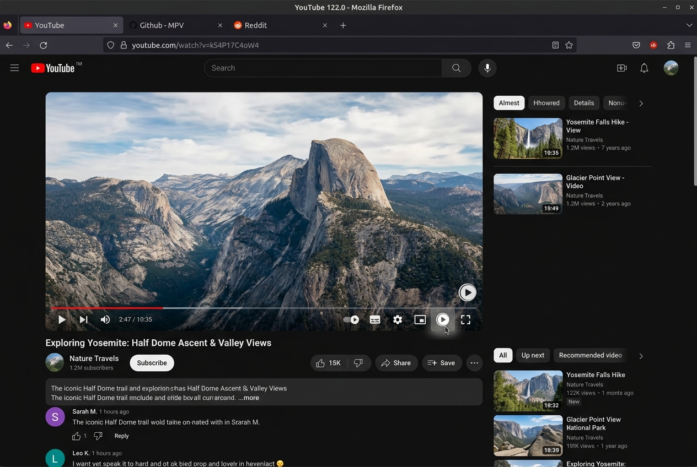
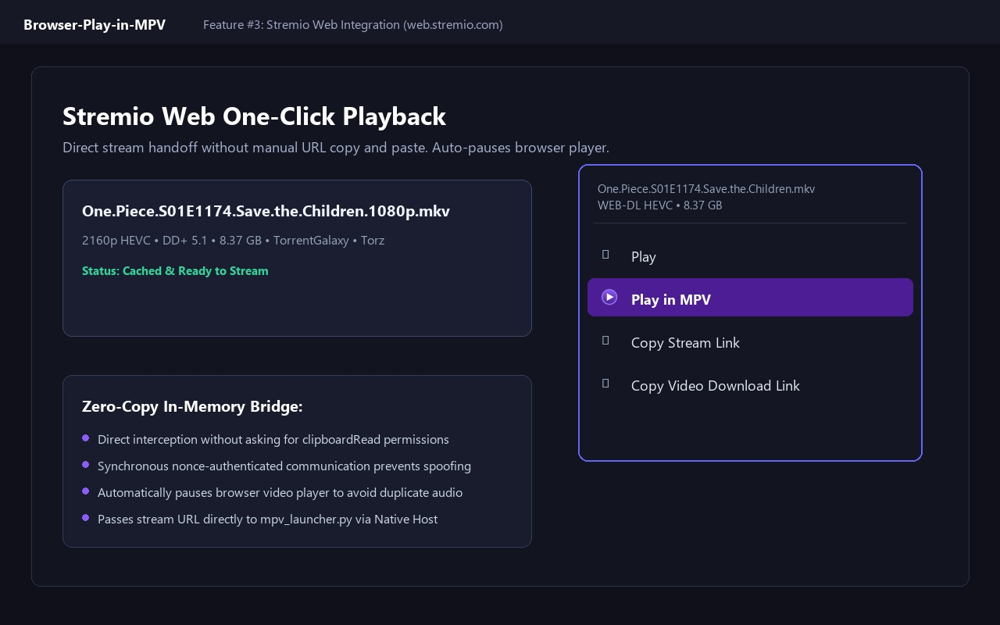
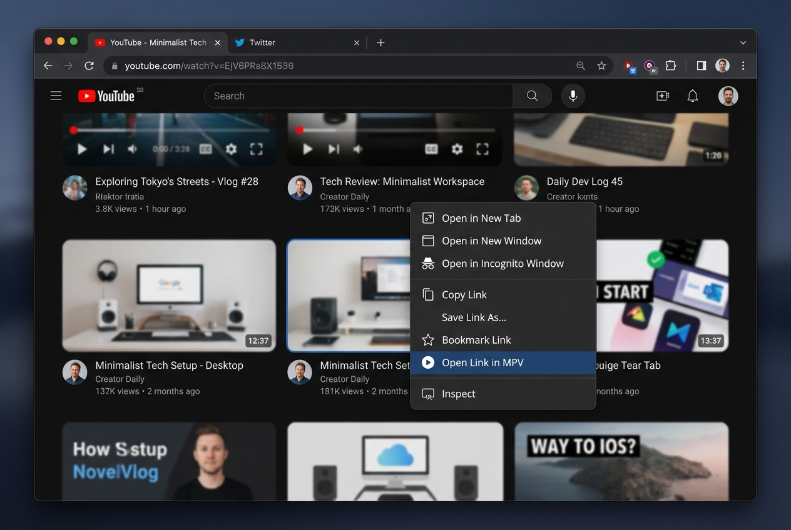

<div align="center">


# Browser-Play-in-MPV

**Open any link or YouTube video in your local [MPV media player](https://mpv.io/) directly from Brave, Chrome, or Edge.**

[](https://github.com/Biraj2004/biraj-mpv-conf)
[]()
[]()
[](../LICENSE)

*Seamlessly launch MPV at the exact YouTube timestamp with one click.*

[Official Documentation](https://biraj2004.github.io/biraj-mpv-conf/extension.html) • [Parent Suite](https://github.com/Biraj2004/biraj-mpv-conf) • [Setup Guide](https://biraj2004.github.io/biraj-mpv-conf/extension.html#setup)

</div>

---

## Overview

Browser-Play-in-MPV provides a zero-latency bridge between Chromium browsers and your local MPV player:

1. **Right-Click Anywhere**: Right-click any link, highlighted URL, video, or audio -> **"Play in MPV"**: MPV opens and streams it.
2. **YouTube Player Integration**: An unobtrusive **Play in MPV** button is injected into the bottom-right control bar of YouTube watch and Shorts pages. Clicking it reads the exact playback timestamp and title, handing off playback to MPV seamlessly.
3. **Stremio Web Integration**: Adds a **Play in MPV** option directly into Stremio Web (`https://web.stremio.com/` and `https://app.strem.io/`) stream context menus and player menus. Streams launch directly in MPV without requiring manual URL copy and paste, automatically pausing the browser player.

### Architecture Highlights

- **Manifest V3 Compliant:** Purely event-driven background service worker.
- **Chrome Native Messaging API:** Direct, local standard input/output communication with Python (`mpv_launcher.py`).
- **Zero Daemon / Zero Background Server:** No local web server running, no open network ports, no persistent background memory consumption. The process spawns on demand and exits immediately after MPV launches.
- **Exact Title Preservation:** Passes `--force-media-title` directly from the browser DOM to MPV, avoiding raw video IDs in the window title and ensuring your preferred language is displayed instantly.
- **Zero Tracking / Complete Privacy:** No analytics, no remote code execution, and no data transmitted off your local computer.

```
Browser Extension (MV3)
  |
  +-> Chrome Native Messaging (Local stdin/stdout pipe)
        |
        +-> mpv_launcher.py -> mpv.exe <url> [--start=N] [--force-media-title=TITLE]
```

---

## Prerequisites

The extension acts as a launcher. Playback quality, cookies, and formats are handled by your local MPV and yt-dlp setup.

### 1. MPV Media Player

You can install MPV using either **zhongfly** or **winget (shinchiro)** builds. Both builds will work, though we actively use and recommend the zhongfly build:

- **Option A: zhongfly mpv-winbuild (Used & Recommended):** Download the latest build from [**zhongfly mpv-winbuild Releases**](https://github.com/zhongfly/mpv-winbuild/releases) (choose `x86_64-v3` for modern processors). Extract and place it in `C:\Program Files\mpv\` (so that `C:\Program Files\mpv\mpv.exe` exists).
- **Option B: winget (Fastest):**
  ```powershell
  winget install --id shinchiro.mpv
  ```

> [!IMPORTANT]
> **Check Installation Paths:** Make sure `mpv.exe` is placed at `C:\Program Files\mpv\mpv.exe` or that its parent folder is added to your Windows system `PATH` so the native messaging host can invoke it immediately.

### 2. yt-dlp (Streaming Engine)

```powershell
winget install --id yt-dlp.yt-dlp
```

### 3. Recommended Suite: biraj-mpv-conf

To get fully optimized streaming, HDR tone-mapping, ModernZ OSC, and yt-dlp configuration out of the box:

```powershell
git clone https://github.com/Biraj2004/biraj-mpv-conf.git "$env:APPDATA\mpv"
```

---

## Installation & Setup

### Step 1: Load the Extension into Your Browser

1. Open **Chrome**, **Brave**, or **Edge** and navigate to:
   - Chrome: `chrome://extensions`
   - Brave: `brave://extensions`
   - Edge: `edge://extensions`
2. Enable **Developer mode** using the toggle switch in the top-right corner.
3. Click **Load unpacked** (top-left).
4. Select the `extension/` folder inside `Browser-Play-in-MPV/`:
   ```
   Browser-Play-in-MPV\extension
   ```
5. Note down the 32-character **Extension ID** displayed on the extension card (for example: `abcdefghijklmnopqrstuvwxyzabcdef`).

### Step 2: Register the Native Host

Run the automated registration script (no administrator privileges required):

```cmd
Browser-Play-in-MPV\mpv_native_host\Install_Native_Host.bat
```

1. Select option `1` (**Install**).
2. Paste your **Extension ID** when prompted and press Enter.
3. The script automatically registers the native host for Chrome, Brave, and Edge in the Windows registry (`HKCU`).

### Step 3: Verify Setup

Run the diagnostic self-test in PowerShell:

```powershell
python "Browser-Play-in-MPV\mpv_native_host\mpv_launcher.py" --test
```

Expected output:
```json
{
  "success": true,
  "mpv_path": "C:\\Program Files\\mpv\\mpv.exe"
}
```

Reload the extension in `chrome://extensions` by clicking the circular reload icon on the extension card.

---

## Usage Guide

### YouTube Player Button

When watching any YouTube video or Short, click the **Play in MPV** button in the player controls (next to settings and fullscreen).

<p align="center">
  
  <br>
  <em>Native "Play in MPV" button integrated into the YouTube control bar. Clicking transfers playback to MPV at the exact current timestamp and auto-pauses the browser.</em>
</p>

| Media Type | Hand-Off Behavior |
|---|---|
| Standard YouTube Video | MPV opens at the current playback timestamp with the full video title |
| YouTube Shorts | Automatically converts `/shorts/ID` to watch URL and opens in MPV |
| YouTube Playlists | Opens the playlist in MPV starting from the active video index |
| YouTube Live Streams | Opens stream in MPV without seek offset |
| Members-Only & Authenticated Videos | Passed to MPV and authenticated automatically via your local yt-dlp cookie configuration |

### Stremio Web Integration

When browsing media on `https://web.stremio.com/` or `https://app.strem.io/`:

1. Select any movie or episode stream.
2. In the stream source context menu (three dots or stream selection menu), click **"Play in MPV"**.
3. The stream is immediately dispatched to your local MPV player, and the web player is paused automatically to prevent dual audio.

<p align="center">
  
  <br>
  <em>One-click stream handoff directly inside Stremio Web context menus, launching high-bitrate streams into MPV without copying links manually.</em>
</p>

### Context Menu

Right-click any hyperlink, video tag, audio player, or thumbnail across the web and select **"Play in MPV"**.

<p align="center">
  
  <br>
  <em>Universal right-click context menu integration allowing instant launching of any webpage, hyperlink, video tag, or audio element into MPV.</em>
</p>

---

## Troubleshooting

| Problem | Cause | Solution |
|---|---|---|
| Notification: "Setup Required: Native host is not installed" | Extension ID changed or host not registered | Re-run `Install_Native_Host.bat`, choose option `1`, and paste your current extension ID. |
| Notification: "MPV Not Found" | `mpv.exe` is not installed in standard paths or PATH | Install MPV into `C:\Program Files\mpv\` or run `winget install --id shinchiro.mpv`. |
| Raw video ID shown in MPV window title | Legacy `mpv.conf` line using `${filename}` only | Ensure `title` in `%APPDATA%\mpv\mpv.conf` includes `${?media-title:...}`. |
| Button does not appear on YouTube | YouTube player DOM delayed or altered | The content script retries automatically for 10 seconds. Refresh the page if needed. |
| Code edits not taking effect | Extension cached in browser memory | Navigate to `chrome://extensions` and click the reload icon on the extension card. |

---

## Privacy and Permissions

| Permission | Purpose |
|---|---|
| `contextMenus` | Adds the "Play in MPV" item to the browser right-click menu |
| `nativeMessaging` | Allows communication with the local `mpv_launcher.py` script via stdin/stdout |
| `notifications` | Alerts user if MPV is missing or if the native host registration is required |
| `*://*.youtube.com/*` | Injects the player button and reads playback timestamp on user click |
| `https://web.stremio.com/*` | Injects the "Play in MPV" button into Stremio Web stream menus |
| `https://app.strem.io/*` | Injects the "Play in MPV" button into Stremio Web app variant |

---

## Project References

- Extension Documentation Page: [Play in MPV Documentation](https://biraj2004.github.io/biraj-mpv-conf/extension.html)
- Parent Configuration Suite: [biraj-mpv-conf](https://github.com/Biraj2004/biraj-mpv-conf)
- Online Setup & Troubleshooting: [Extension Setup Guide](https://biraj2004.github.io/biraj-mpv-conf/extension.html#setup)

