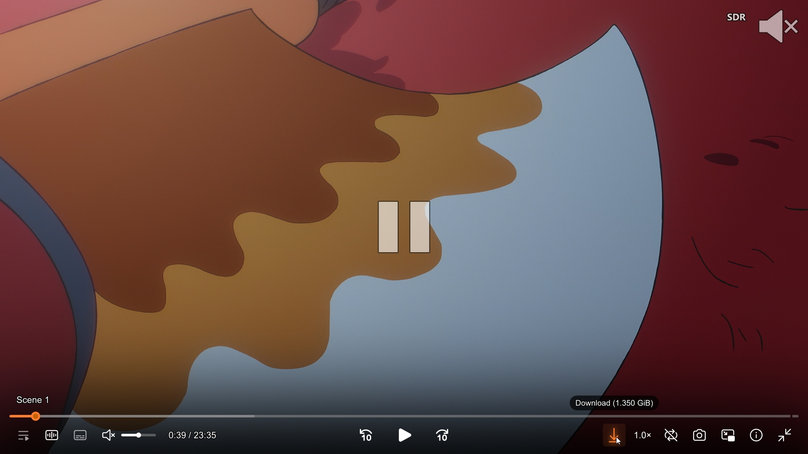
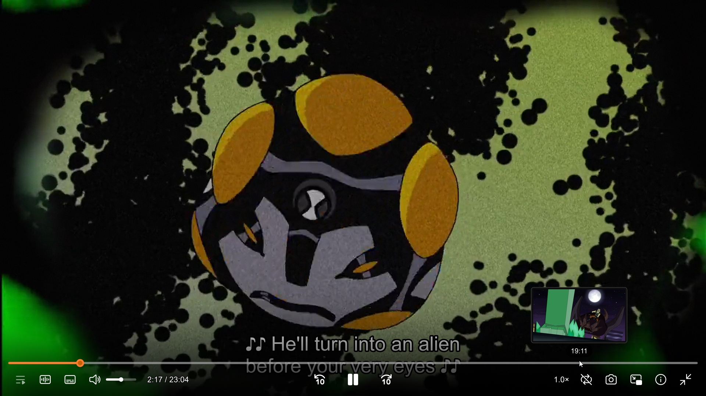
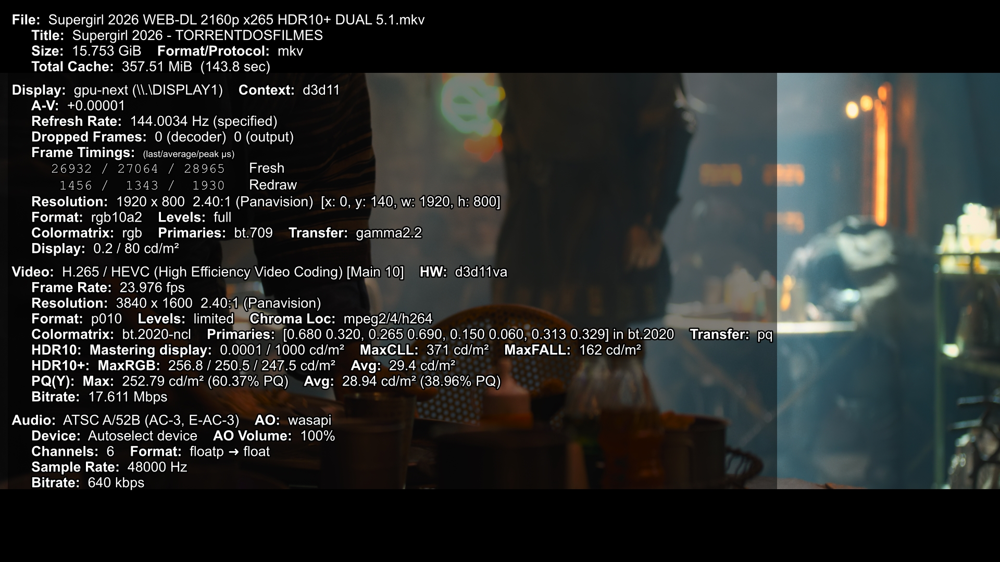
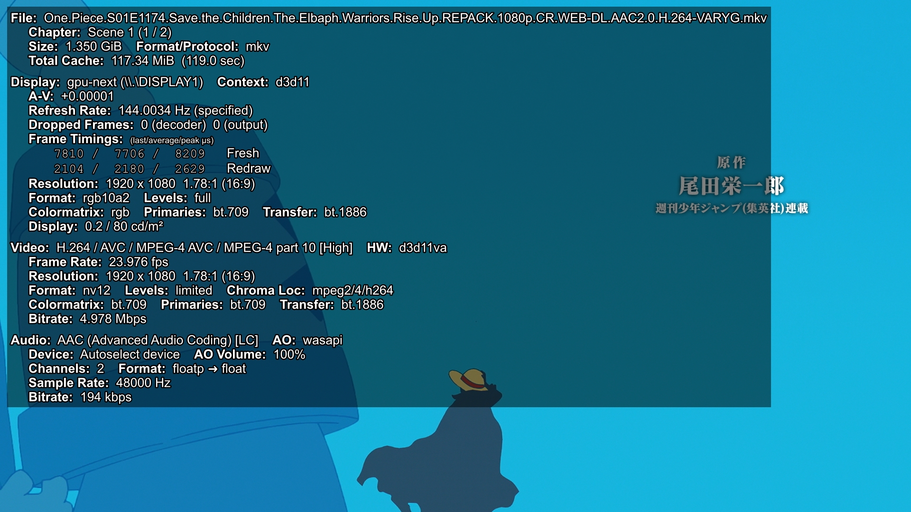
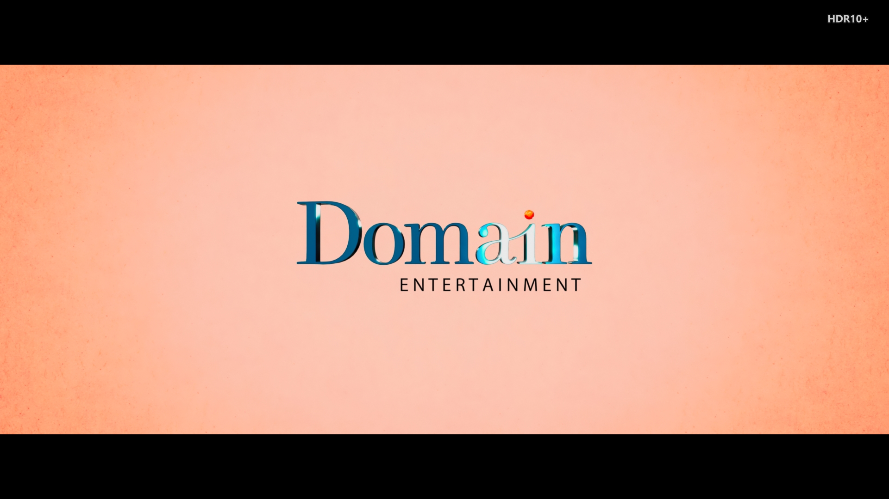
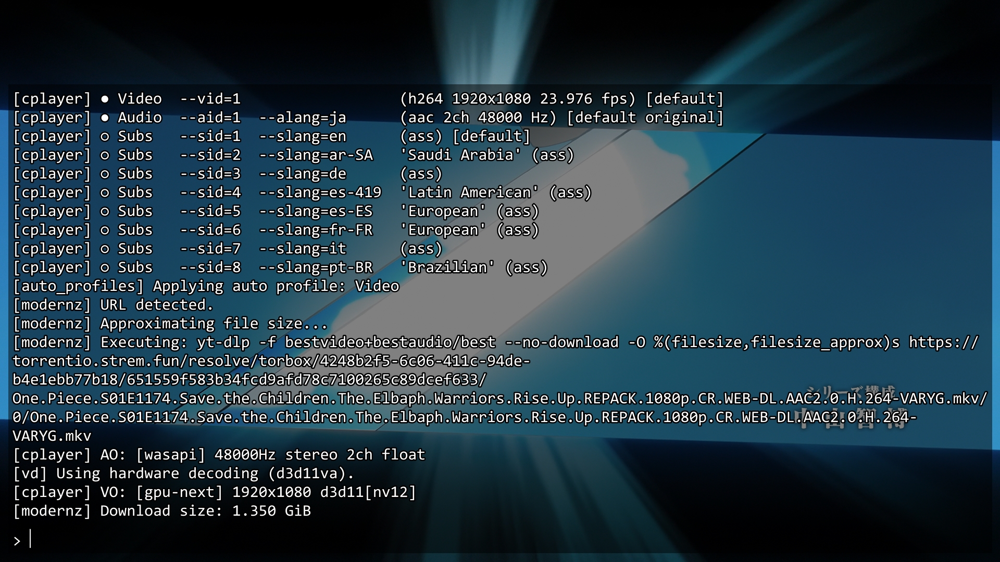
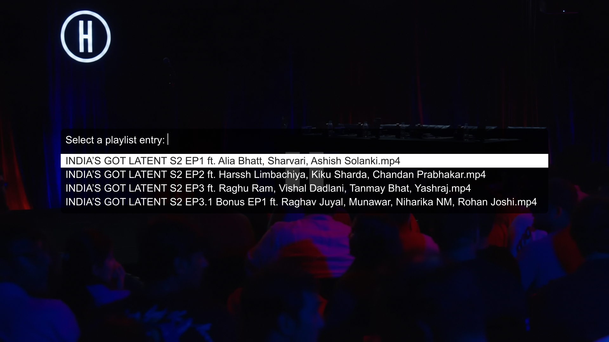
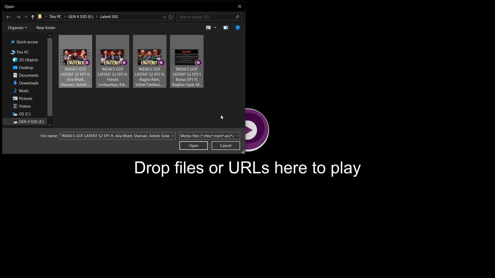
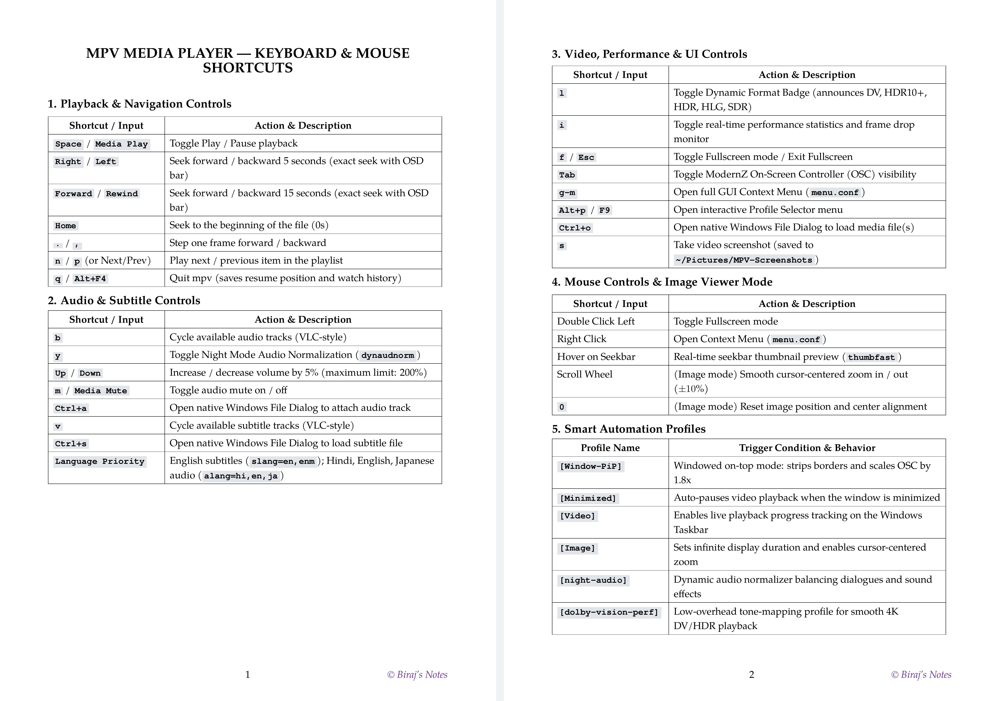
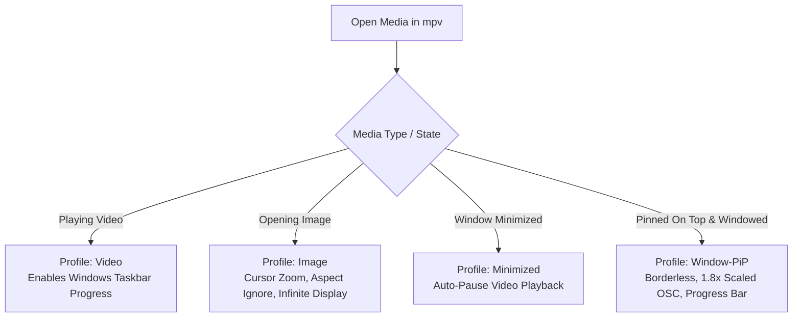

<div align="center">

# biraj-mpv-conf

**A refined, ultra-optimized, and modern configuration suite for [mpv media player](https://mpv.io/).**

[](https://mpv.io/)
[](https://mpv.io/manual/master/#options-vo)
[](https://mpv.io/manual/master/#options-hwdec)
[-orange?style=for-the-badge)](https://github.com/Samillion/ModernZ)
[](SECURITY.md)
[](LICENSE)

<br/>

*Bridges the gap between mpv's lightweight performance and a sleek, feature-rich modern media player experience.*

[Live Documentation Website](https://biraj2004.github.io/biraj-mpv-conf/) • [Quick Start / Installation](#installation) • [Visual Showcase](#visual-showcase) • [How to Play](#how-to-play--usage-guide) • [Key Features](#key-features) • [Keybindings](#keyboard--mouse-shortcuts) • [Smart Profiles](#smart-automation-profiles) • [HDR & Tone-Mapping](#hdr--dolby-vision-playback) • [Customization](#customization) • [Credits](#credits--acknowledgements)

---

</div>

## Overview

**`biraj-mpv-conf`** elevates mpv from a minimalist, command-line-driven player into a polished desktop media powerhouse. Designed with performance, aesthetics, and convenience in mind, it combines next-generation video rendering pipelines with a modern Fluent/Material user interface, interactive right-click context menus, fast hover thumbnails, native file pickers, dynamic audio normalization, and smart contextual profiles.

---

## Visual Showcase

<div align="center">

### Modern Interface & Visual Scrubbing

| ModernZ OSC & Center Pause Indicator | Thumbfast Hover Preview & Subtitles |
| :---: | :---: |
| [](screenshots/modernz-osc-pause-indicator.jpg) | [](screenshots/thumbfast-hover-preview-subtitles.jpg) |
| *ModernZ Fluent controller, chapter title, stream download button, center pause badge & format badge.* | *Instant seekbar hover thumbnail preview (`thumbfast`) with high-contrast, black-outlined subtitle rendering.* |

### Real-Time Engine & Playback Performance

| 4K HDR10+ Playback Statistics (`gpu-next`) | 1080p SDR Video Playback Statistics |
| :---: | :---: |
| [](screenshots/stats-overlay-4k-hdr10plus.jpg) | [](screenshots/stats-overlay-1080p-sdr.jpg) |
| *`gpu-next` rendering pipeline, D3D11VA HW decode, 144 Hz display sync, and HDR10+ peak brightness metadata.* | *1080p AVC decoding, frame timings, 0 dropped frames, WASAPI audio output, and chapter indexing.* |

### Format Detection & Interactive Stream Diagnostics

| Dynamic HDR10+ Format Badge Overlay | Interactive Console & Stream Log Overlay |
| :---: | :---: |
| [](screenshots/hdr10plus-badge-overlay.jpg) | [](screenshots/interactive-console-stream-log.jpg) |
| *Top-right floating badge (`hdr_badge.lua`) automatically announcing detected HDR10+ format on start.* | *Interactive REPL console (`~`), automatic profile switching, ModernZ URL detection, and yt-dlp log stream.* |

### Smart Playlist Sorting & Native File Dialog

| Natural Ascending Playlist Sorter | Native File Picker Dialog (Unicode Support) |
| :---: | :---: |
| [](screenshots/playlist-menu-ascending-sort.jpg) | [](screenshots/native-file-picker-dialog.jpg) |
| *Interactive playlist selection menu automatically arranged in natural numerical ascending order (EP1 &rarr; EP2 &rarr; EP3 &rarr; EP3.1).* | *Windows native file picker dialog (<kbd>Ctrl</kbd>+<kbd>O</kbd>) supporting Unicode characters, curly quotes, and special symbols.* |

</div>

---

## Installation

### ⚡ Quick Install via winget (Recommended)

Install MPV (shinchiro build — the recommended Windows build) and yt-dlp with two commands:

```powershell
# Install MPV (shinchiro build)
winget install --id shinchiro.mpv

# Install yt-dlp (YouTube streaming backend — required for online streaming)
winget install --id yt-dlp.yt-dlp
```

> [!NOTE]
> After installing via winget, continue to **Step 1** below to install this configuration suite. The winget MPV install places `mpv.exe` in a versioned folder — you can still use it with a portable `portable_config` folder, or move it to `C:\Program Files\mpv\` for full compatibility with all suite tools.

---

### Step 0: Download & Set Up MPV on Windows (Standard Location)

To ensure 100% plug-and-play compatibility across Windows File Explorer context menus ([`Windows-Context-Menu/`](Windows-Context-Menu/)), Stremio desktop player hooks ([`Stremio-Play-in-MPV/`](Stremio-Play-in-MPV/)), Browser extension ([`Browser-Play-in-MPV/`](Browser-Play-in-MPV/)), and batch scripts, set up MPV in the standard Windows directory:

1. **Download MPV for Windows**:
   - **Via winget (quickest):** `winget install --id shinchiro.mpv`
   - **Manual download:** Latest 64-bit build from **[zhongfly mpv-winbuild releases](https://github.com/zhongfly/mpv-winbuild/releases)** (or [shinchiro builds](https://sourceforge.net/projects/mpv-player-windows/files/)).
2. **Extract, Rename, and Place in `C:\Program Files\mpv\`**:
   - Extract the downloaded archive (e.g. `mpv-x86_64-v3-*.7z` or `.zip`).
   - Rename the extracted folder to **`mpv`** and move it directly to **`C:\Program Files\`**.
   - Your primary executable will reside at:
     ```plaintext
     C:\Program Files\mpv\mpv.exe
     ```
3. **Register File Types & Protocols**:
   - Inside `C:\Program Files\mpv\`, right-click **`mpv-register.bat`** &rarr; click **Run as administrator** to register video extensions and protocols with Windows.

> [!IMPORTANT]
> **Standard Paths Used Across This Suite:**
> - **Player Executable:** `C:\Program Files\mpv\mpv.exe`
> - **Configuration Directory:** `C:\Users\<YourUsername>\AppData\Roaming\mpv\` (accessible via `%APPDATA%\mpv`)
> 
> *If you previously installed or extracted MPV into a different location (such as `C:\mpv\`, `%LOCALAPPDATA%\Programs\mpv\`, or a custom drive), simply move/rename that folder to `C:\Program Files\mpv\` so all context menus, registry scripts, and external tools work instantly without manual configuration.*

---

### Step 1: Install Configuration & Scripts

### Full Target Paths on Windows

| Mode | Target Directory | Description |
| :--- | :--- | :--- |
| **Standard (Roaming)** | `C:\Users\<YourUsername>\AppData\Roaming\mpv\` | Default configuration location for installed mpv builds (accessible via `%APPDATA%\mpv`). |
| **Portable** | `C:\<PathToMpv>\portable_config\` | Used for standalone/portable mpv installations. |

---

### Method 1: Standard Installation (Windows) — *Recommended*

#### Option A: Automated Sync & Update via Batch Script (`.bat`) — *Recommended*
Download or clone this repository and simply double-click:
```cmd
Fetch_And_Update_Biraj_MPV_Config_From_Latest_GitHub_Commit.bat
```
- **Player Verification**: Automatically checks whether `mpv.exe` is installed on your system at standard locations (with guided setup advisory if missing).
- **Live GitHub API Status**: Queries and displays the latest commit SHA, author, UTC timestamp, and commit message directly from GitHub's `main` branch.
- **Safety Gate & Confirmation**: Interactive `[Y/N]` confirmation prompt before any files are downloaded or modified.
- **Automatic Safety Backup**: Creates a timestamped ZIP archive of your existing configuration in `%APPDATA%\mpv\backups\biraj-mpv-conf-backup-<timestamp>.zip` prior to updating (automatically retains the 5 newest).
- **High-Speed Deployment**: Downloads and synchronizes all configuration files, scripts, script-opts, and fonts directly into `%APPDATA%\mpv\`.
- **Intelligent Re-Run Handling**: Tracks the installed commit in `%APPDATA%\mpv\biraj-mpv-version.txt`. If already up to date, it notifies you and asks if you wish to force a re-download.

#### Option B: Manual Extraction (ZIP)
1. Download this repository as a ZIP archive: [**Download ZIP**](https://github.com/Biraj2004/biraj-mpv-conf/archive/refs/heads/main.zip).
2. Press <kbd>Win</kbd> + <kbd>R</kbd>, type `%APPDATA%\mpv`, and press **Enter** (or navigate to `C:\Users\<YourUsername>\AppData\Roaming\mpv\`).
3. Copy **only the necessary configuration folders and files** (`fonts/`, `scripts/`, `script-opts/`, `mpv.conf`, `input.conf`, `menu.conf`, `yt-dlp.conf`) from the extracted folder directly into `%APPDATA%\mpv\`. *(You do not need to copy repository docs, screenshots, or license files into mpv).*
4. Your resulting `%APPDATA%\mpv\` directory should look cleanly like this:
   ```plaintext
   C:\Users\<YourUsername>\AppData\Roaming\mpv\
   ├── fonts/
   │   └── modernz-icons.ttf
   ├── script-opts/
   │   ├── auto_exit_eof.conf
   │   ├── hdr_badge.conf
   │   ├── modernz.conf
   │   ├── pause_indicator_lite.conf
   │   ├── pause_notify.conf
   │   ├── resume_indicator.conf
   │   └── thumbfast.conf
   ├── scripts/
   │   ├── auto_exit_eof.lua
   │   ├── cache_manager.lua
   │   ├── cycle_audio.lua
   │   ├── hdr_badge.lua
   │   ├── modernz.lua
   │   ├── open-file.lua
   │   ├── pause_indicator_lite.lua
   │   ├── pause_notify.lua
   │   ├── resume_indicator.lua
   │   ├── single_instance.lua
   │   ├── sort_playlist.lua
   │   └── thumbfast.lua
   ├── input.conf
   ├── menu.conf
   ├── mpv.conf
   └── yt-dlp.conf
   ```
5. **Install Icons Font**: Open `fonts/` inside your mpv directory, double-click `modernz-icons.ttf`, and click **Install**.

---

### Method 2: Portable Installation (All-in-One Folder)

If you are using a portable mpv build (e.g., extracted to `C:\mpv\` or a USB drive):
1. Navigate to your mpv root directory (where `mpv.exe` resides).
2. Create a folder named `portable_config` if one does not exist.
3. Copy **only the necessary configuration files and folders** directly into `portable_config`:
   ```plaintext
   C:\mpv\portable_config\
   ├── fonts/
   │   └── modernz-icons.ttf
   ├── script-opts/
   │   ├── auto_exit_eof.conf
   │   ├── hdr_badge.conf
   │   ├── modernz.conf
   │   ├── pause_indicator_lite.conf
   │   ├── pause_notify.conf
   │   ├── resume_indicator.conf
   │   └── thumbfast.conf
   ├── scripts/
   │   ├── auto_exit_eof.lua
   │   ├── cache_manager.lua
   │   ├── cycle_audio.lua
   │   ├── hdr_badge.lua
   │   ├── modernz.lua
   │   ├── open-file.lua
   │   ├── pause_indicator_lite.lua
   │   ├── pause_notify.lua
   │   ├── resume_indicator.lua
   │   ├── single_instance.lua
   │   ├── sort_playlist.lua
   │   └── thumbfast.lua
   ├── input.conf
   ├── menu.conf
   ├── mpv.conf
   └── yt-dlp.conf
   ```
4. Install `fonts/modernz-icons.ttf` onto your system to enable vector icons.

---

### Method 3: Linux / macOS

While engineered primarily for Windows with Direct3D 11 Flip presentation, WASAPI shared audio, and PowerShell dialogs, this configuration is fully cross-platform with seamless, automatic native fallbacks for Linux and macOS:

1. Clone or extract the repository to `~/.config/mpv/`:
   ```bash
   git clone https://github.com/Biraj2004/biraj-mpv-conf.git ~/.config/mpv
   ```
2. **Native Cross-Platform Features Built-In**:
   - **Native File Dialogs (<kbd>Ctrl</kbd>+<kbd>O</kbd>)**: Windows uses native PowerShell WPF dialogs. macOS automatically invokes built-in Cocoa file pickers via AppleScript (`osascript`) with zero dependencies. Linux invokes native GTK/KDE pickers (`zenity` / `kdialog`).
   - **Audio Pipelines**: Prioritizes `wasapi` on Windows, falling back seamlessly to `coreaudio` on macOS, and `pipewire` / `pulse` on Linux (`ao=wasapi,coreaudio,pipewire,pulse,`).
   - **Hardware Video Acceleration**: `hwdec=auto-safe` automatically negotiates `d3d11va`/`nvdec` on Windows, `vaapi`/`nvdec` on Linux, and `videotoolbox` on macOS.
   - **Thumbfast & Single-Instance IPC**: Windows leverages ultra-fast Win32 FFI Named Pipes, while Linux and macOS automatically use POSIX in-memory Unix domain sockets (`/tmp/thumbfast`) and safe `/tmp` lockfiles.

---

## How to Play & Usage Guide

### 1. Playing Local Media Files & Folders
- **Drag & Drop**: Drag any video, audio track, image, or entire directory directly onto the mpv window.
- **Native File Dialog (<kbd>Ctrl</kbd> + <kbd>O</kbd>)**: Press <kbd>Ctrl</kbd> + <kbd>O</kbd> (or right-click $\rightarrow$ **Open** $\rightarrow$ **Open File**) to open the native Windows File Explorer picker. Select single or multiple files to load into the playlist.
- **Default Player Integration**: Right-click any media file in Windows File Explorer $\rightarrow$ **Open with** $\rightarrow$ **Choose another app** $\rightarrow$ select **mpv** and check *"Always use this app"*.

### 2. Streaming Online URLs (YouTube, Twitch, Playlists & Web Videos)
- **Drag & Drop URL**: Copy any video/stream or playlist link from your web browser and drag/drop it directly into the mpv window.
- **Playlists Support**: Automatically extracts and plays all playlist items when opening/pasting playlist URLs (`youtube.com/playlist?list=...` or `watch?v=...&list=...`).
- **Command Line / Terminal**:
  ```powershell
  # Stream video (automatically plays 2K 1440p -> 1080p -> 720p best available)
  mpv "https://www.youtube.com/watch?v=dQw4w9WgXcQ"

  # Stream uncapped highest quality (4K UHD / 8K)
  mpv --profile=q-best "https://www.youtube.com/watch?v=dQw4w9WgXcQ"

  # Stream capped at 2160p (4K UHD)
  mpv --profile=q-2160p "https://www.youtube.com/watch?v=dQw4w9WgXcQ"

  # Stream capped at 1440p (2K)
  mpv --profile=q-1440p "https://www.youtube.com/watch?v=dQw4w9WgXcQ"

  # Stream a full YouTube playlist
  mpv "https://www.youtube.com/playlist?list=PLrEnWoR732-BHrPp_Pm8_VleD68f9n14-"

  # Stream capped at 1080p Full HD
  mpv --profile=q-1080p "https://www.youtube.com/watch?v=dQw4w9WgXcQ"

  # Stream capped at 720p HD
  mpv --profile=q-720p "https://www.youtube.com/watch?v=dQw4w9WgXcQ"
  ```
- **Switch Stream Quality On-The-Fly**:
  - **Right-Click**: Navigate to **Video** $\rightarrow$ **YT-Stream Quality** and select `720p`, `1080p`, `1440p`, or `Best`.
  - **Keyboard**: Press <kbd>Ctrl</kbd> + <kbd>y</kbd> to cycle between stream resolutions (720p $\rightarrow$ 1080p $\rightarrow$ 1440p $\rightarrow$ Best).
  - *The stream instantly reloads at the new resolution and resumes from your current second.*
- **One-Click Stream Download (Native WebM/MP4 & Selective TS $\rightarrow$ MKV)**: Click the download button on the ModernZ controller bar to save the online video directly to `~/Downloads/MPV-Downloads` (auto-created if missing).
  - **Selective Remuxing**: Converts segmented HLS transport streams (`.ts`) into `.mkv` for smooth seeking and full container stability, while preserving native `.webm` (YouTube VP9/AV1) and `.mp4` formats untouched.
  - **Seamless Windows Explorer Thumbnails (via Icaros)**: Designed to pair seamlessly with [Icaros](https://www.videohelp.com/software/Icaros) for real-time video preview thumbnails directly from video frames across `.webm`, `.mkv`, and `.mp4` files without forced container conversion.
  - Injects full video metadata (Title, Artist, Uploader, Date, Description) and embedded chapter markers.
  - Accelerates download speed via multi-threaded concurrent fragment fetching (`--concurrent-fragments 4`).

### 3. Dedicated `yt-dlp.conf` (Network Resilience, Anti-Throttling & 99% Reliability)
Advanced streaming options are cleanly separated into [`yt-dlp.conf`](yt-dlp.conf). Using native `yt-dlp` configuration options avoids overwriting player settings and gives full control over downloads and network handling:

- **Network Resilience & Anti-Throttling**: 10 connection retries, 10 fragment retries, 4 concurrent DASH chunks, and automated TLS certificate handling survive temporary Wi-Fi hiccups and prevent HTTP 403 throttling.
- **Embedded Subtitles & Rich Metadata**: Automatically embeds official subtitles, metadata tags, and chapter markers.
- **Selective Remuxing**: Automatically remuxes segmented HLS transport streams (`.ts`) into Matroska (`.mkv`) while leaving native `.webm` and `.mp4` streams untouched.
- **Playlist Safety**: Ignores deleted/private videos in playlists without terminating playback.
- **Where to Place `yt-dlp.conf`**:
  1. Inside `%APPDATA%\mpv\` alongside `mpv.conf` (or `%APPDATA%\yt-dlp\config`).
  2. Or in your mpv folder alongside `yt-dlp.exe` / `mpv.exe`.

#### Unlocking Age-Restricted & Premium Streams (Cookies Authentication)
YouTube enforces session authentication on certain high-resolution and age-restricted streams. In [`yt-dlp.conf`](yt-dlp.conf), you have two flexible methods:

- **Option A: Custom Exported Cookies File (Primary & Reliable Fallback)**:
  Chromium-based browsers (Brave, Chrome, Edge) lock their SQLite cookie database while running or apply DPAPI encryption, causing `Could not copy Chrome cookie database` errors. Pointing directly to your exported cookies file bypasses this completely and works 100% reliably:
  ```ini
  --cookies "E:\YouTube Downloader (yt-dlp)\yt-cookies.txt"
  ```
  *(Export your cookies once using the **Get cookies.txt LOCALLY** extension and save to your preferred directory).*

- **Option B: Live Browser Session (Zero Manual Export)**:
  If you use Mozilla Firefox (which doesn't lock cookie databases during playback), comment out Option A and uncomment Firefox:
  ```ini
  --cookies-from-browser firefox
  # --cookies-from-browser brave
  # --cookies-from-browser chrome
  # --cookies-from-browser edge
  ```

> [!TIP]
> If live browser extraction ever fails with a database lock, simply fallback to your static `yt-cookies.txt` file in `yt-dlp.conf`.

### 4. Adding Subtitles & External Audio Tracks
- **Drag & Drop**: Drag any `.srt`, `.ass`, `.vtt`, or `.sub` file directly onto the playing video.
- **Native Subtitle Dialog (<kbd>Ctrl</kbd> + <kbd>S</kbd>)**: Opens Windows Explorer to browse and attach subtitles.
- **Native Audio Track Dialog (<kbd>Ctrl</kbd> + <kbd>A</kbd>)**: Opens Windows Explorer to add secondary audio tracks (e.g. commentary, alternative dubs).
- **Quick Track Cycling**:
  - Press <kbd>v</kbd> / <kbd>Shift</kbd> + <kbd>v</kbd> (<kbd>V</kbd>) *(or standard mpv <kbd>j</kbd> / <kbd>J</kbd>)* to cycle subtitle tracks forward / backward *(VLC & MPV standard, anti-spam debounced, instant 0ms OSD, includes Off/None state)*.
  - Press <kbd>b</kbd> to cycle audio languages forward or <kbd>Shift</kbd> + <kbd>b</kbd> (<kbd>B</kbd>) backward *(or standard mpv <kbd>_</kbd> / <kbd>#</kbd>)* *(VLC & MPV standard, loops languages, anti-spam debounced, instant 0ms OSD)*.

### 5. Essential Playback Controls
- **Play / Pause**: <kbd>Space</kbd> or <kbd>Media Play/Pause</kbd>
- **Exact Seeking**: <kbd>→</kbd> / <kbd>←</kbd> (6s exact) • <kbd>Media Forward/Rewind</kbd> (15s exact) • <kbd>Home</kbd> (beginning)
- **Volume & Mute**: <kbd>↑</kbd> / <kbd>↓</kbd> (±5%) • <kbd>m</kbd> (Mute)
- **Toggle Fullscreen**: <kbd>f</kbd> or **Double Click Left Mouse**
- **Context Menu**: <kbd>Right Click</kbd> or <kbd>g</kbd> <kbd>m</kbd>
- **Night Mode Audio Normalization**: <kbd>y</kbd> or <kbd>N</kbd> (balances loud explosions & quiet dialogue)
- **Real-Time Performance Stats**: <kbd>i</kbd> (fps, dropped frames, decoder, HDR nits)

---

## Key Features

### Modern UI and Fluent On-Screen Controller
- **[ModernZ](https://github.com/Samillion/ModernZ) OSC Interface**: Replaces the default interface with a clean, responsive On-Screen Controller styled with Fluent/Material vector icons.
- **Translucent Minimalist OSD**: Dark pill-box OSD overlays with crisp typography (`osd-duration=2500` 2.5s readable duration, `osd-playing-msg-duration=2500` 2.5s startup filename duration), eliminating disruptive double seekbars (`osd-bar=no`).
- **Unified OSD Seeking Bar**: Both keyboard arrow seeks and ModernZ controller jump buttons (`<10` / `10>`) invoke `osd-msg-bar` for consistent position and duration timestamp display (`[00:01:23 / 00:45:00]`).
- **Sleek Pause / Play Indicator**: Minimalist, non-distracting center pause/unpause visual flash indicators ([`pause_indicator_lite`](https://github.com/Samillion/ModernZ/tree/main/extras/pause-indicator-lite)).
- **Action-Based Controls & State-Based Overlay Philosophy**:
  - **Bottom OSC Control Bar (Action-Based — YouTube/VLC Standard)**: The interactive buttons follow the standard media player trigger philosophy, displaying the **action to be performed on click** (e.g. shows `▶` Play when paused to resume, and `||` Pause when playing to pause).
  - **Center Canvas Overlay (State-Based)**: The center display functions as an immediate **status feedback indicator**, displaying the **current playback state** (e.g. shows `||` Pause icon when paused, and flashes `▶` Play triangle when playback starts/resumes).

### Next-Gen GPU Video Rendering & Tone-Mapping
- **`gpu-next` Engine**: Utilizes mpv's latest libplacebo-powered rendering backend for exceptional color accuracy, high-bitdepth pipelines, and HDR processing.
- **Hardware Direct3D 11 Flip Presentation (`d3d11-flip=yes`)**: Bypasses legacy DWM composition layers for tear-free, flicker-free presentation with 0 dropped frames and instant Alt-Tab.
- **HDR10 & Dolby Vision (DV) Support**: Automatically tone-maps HDR10 and Dolby Vision (Profiles 5 & 8) to SDR on standard displays with optimal dynamic range (`target-contrast=auto`), preserving highlight details and color saturation without washed-out tones. Subtitles retain crisp `#FFFFFF` white on SDR displays (`blend-subtitles=no`, `sub-hdr-peak=120`). Passes dynamic metadata on native HDR monitors (`target-colorspace-hint=auto`).
- **Dynamic HDR / DV / SDR Format Badge**: Minimalist floating overlay badge (`DV`, `HDR10+`, `HDR10`, `HLG`, `SDR`) in the top-right corner that announces the detected color format of the incoming media stream.
- **Auto-Safe Hardware Decoding (`hwdec=auto-safe`)**: Automatically negotiates the fastest, low-CPU/low-power video decoding pipeline (`d3d11va`, `nvdec`, `vaapi`) with safe fallback mechanisms and 16 extra VRAM buffers (`hwdec-extra-frames=16`).
- **Debanding & Dithering**: Eliminates color banding artifacts and gradient compression with balanced, detail-preserving parameters (`iterations=2`, `threshold=35`, `range=16`, `grain=5`, `temporal-dither=yes`). Kept off by default for pure reference playback without loss of fine grain or facial textures, and instantly toggleable on-the-fly with <kbd>g</kbd> whenever you encounter banded content.
- **Windows WASAPI Shared Audio Pipeline (`ao=wasapi`, `audio-exclusive=no`)**: Directly binds mpv to the modern Windows Audio Session API with a microsecond-accurate 90ms hardware clock buffer (`audio-buffer=0.09`) for drift-free A/V sync, zero audio cutoffs on unpause (`audio-stream-silence=yes`), and seamless audio mixing with Discord and web browsers without device-locking.
- **Modern Subtitle Typography (`sub-font="Segoe UI"`)**: Renders standard `.srt` text in clean, modern Segoe UI typography with high-contrast outlines and shadow boxes, while preserving stylized anime `.ass` formatting intact (`sub-ass-override=no`).
- **Centralized & Segregated Cache Architecture ([`cache_manager.lua`](scripts/cache_manager.lua))**: All runtime cache and state data are cleanly isolated in a single common parent directory on the C: drive (`%LOCALAPPDATA%\mpv\cache\`), partitioned into dedicated subdirectories for GPU shaders (`shaders/`), resume watch history (`watch_later/`), hover thumbnails (`thumbnails/`), color profile LUTs (`icc/`), and disk buffer fallbacks (`demuxer/`). Automatically purges 30-minute-old temporary scratch buffers non-blockingly after playback starts (`mp.add_timeout(4.0)`), completely eliminating startup disk I/O contention while keeping the git repository 100% clean.

> [!NOTE]
> **File Format vs. Screen Support**: The badge indicates the **color format received from the video file itself** (e.g. `DV` indicates a Dolby Vision file stream), **not** that your physical display panel supports native Dolby Vision. On standard SDR monitors, mpv automatically decodes the DV/HDR stream and tone-maps it into vivid, accurate SDR in real-time.

### Instant Seekbar Hover Thumbnails
- Integrated with **[`thumbfast`](https://github.com/po5/thumbfast)** to provide instant, real-time visual preview thumbnails when hovering or scrubbing along the seekbar.
- **On-Demand Worker (`spawn_first=no`)**: Thumbnail generator process stays dormant until the cursor hovers over the seekbar, eliminating ~200ms of cold-start delay and completely preventing background process kill/respawn churn during window resizing or fullscreen toggling.
- **High-Speed Direct I/O (`direct_io=yes`)**: Uses unbuffered Windows Win32 Named Pipes via LuaJIT FFI (`CreateFileW`, `WriteFile`, `PIPE_NOWAIT`) to drop first-hover thumbnail latency into the **sub-100ms** zone, with seamless automatic fallback to POSIX Unix domain sockets on Linux and macOS.

### Rich Right-Click Context Menu
- Full-featured **contextual GUI menu** (`menu.conf`) accessible on right-click or via <kbd>g</kbd> <kbd>m</kbd>:
  - Toggle audio/subtitle streams with dedicated `Off / None` option, secondary subtitles, and audio devices.
  - Enable **Night Mode Audio Normalization** directly from the audio menu.
  - Switch ModernZ layouts (*Default, Compact, Mini, Seekbar*) and icon styles (*Fluent, Material*).
  - Adjust playback speed (*0.25x* to *8.0x*), A-B looping, aspect ratios, zoom, and rotation.
  - View real-time playback statistics, drop frames, and media information.
  - Quick-copy media file paths, titles, or active subtitle text to the clipboard.

### Multi-File Playlist Natural Ascending Sorting & Video Filter
- **Strictly Video-Only Drag & Drop Filtering ([`sort_playlist.lua`](scripts/sort_playlist.lua))**: When dragging & dropping multiple files, batches, or folders into mpv, non-video files (`.txt`, `.nfo`, `.srt`, `.mp3`, `.jpg`, `.png`, `.part`, etc.) are automatically filtered out in a single high-speed pass so the playlist contains only playable video episodes.
- **Auto-Attached Subtitles**: Matching subtitle files (`.srt`, `.ass`, `.vtt`) are automatically detected and loaded directly into the active video's subtitle tracks via fuzzy matching (`sub-auto=fuzzy`) without cluttering the playlist list as separate entries.
- **Ultra-Fast & Accurate Natural Ascending Sort**: Precomputed cached keys format numbers with high-precision padding (`padnum`), sorting complex numbers (`01`, `02` ... `10`, `10.5`, `100`), brackets, and titles in under 2ms.
- **Defensive Safety Architecture**: Includes re-entrancy concurrency locks (`is_sorting`), debounced event coalescing (`80ms`), memory batch safety caps (`MAX_SORT_LIMIT = 5000`), protected exception boundaries (`pcall`), and non-video batch detection to prevent crashes or freezing.
- **"Play with MPV as a Playlist" Windows Explorer Context Menu ([`Windows-Context-Menu/`](Windows-Context-Menu/))**: Right-click any single folder, opened folder background, single external drive, or video files in Windows File Explorer to immediately open and play all videos in that folder as a naturally sorted playlist with the official MPV icon. Includes a 1-click installer ([`Setup_Play_with_MPV_Context_Menu.bat`](Windows-Context-Menu/Setup_Play_with_MPV_Context_Menu.bat)), standalone registry scripts, and documentation in [`Windows-Context-Menu/README.md`](Windows-Context-Menu/README.md).
- **Natural Ascending File Dialog Loading ([`open-file.lua`](scripts/open-file.lua))**: Selecting multiple files via <kbd>Ctrl</kbd>+<kbd>O</kbd> automatically sorts them in ascending order before adding them to the playlist.
- **On-Demand Playlist Sorter (<kbd>K</kbd> / Context Menu)**: Instant shortcut (`sort_playlist/sort-playlist`) to re-sort any active playlist into natural ascending order on demand.

### Native GUI File and Track Selectors (Windows-First with macOS & Linux Fallbacks)
- **PowerShell / WPF Native Dialogs** ([`open-file.lua`](https://github.com/Samillion/ModernZ/tree/main/extras/open-file)): Seamlessly browse and open files (<kbd>Ctrl</kbd>+<kbd>O</kbd>), load external subtitles (<kbd>Ctrl</kbd>+<kbd>S</kbd>), or attach secondary audio tracks (<kbd>Ctrl</kbd>+<kbd>A</kbd>) using standard Windows File Explorer dialogs with natural ascending sort.
- **Cross-Platform Dialog Fallbacks**: When running on macOS, automatically launches native Cocoa file pickers via built-in AppleScript (`osascript`) with zero dependencies. On Linux, automatically launches native GTK/KDE file pickers via `zenity` or `kdialog`.

### Smart Dynamic Profiles & Audio Normalization
- **Night Mode Audio Normalization & Dialogue Clarity (<kbd>N</kbd> / <kbd>y</kbd>)**: Real-time vocal presence enhancement (`equalizer`), low-end de-mudding (`highpass`), and dynamic compression (`dynaudnorm`) to balance quiet dialogue and loud sound effects during late-night viewing.
- **Ultra-Fast 90ms WASAPI Audio Buffer (`audio-buffer=0.09`)**: Fast buffer fill time on track switches while remaining 100% immune to audio underruns and crackles.
- **Zero-Delay Persistence Safeguards**: Any manual audio/subtitle delay applied to defective media is automatically isolated—never saved to resume files and reset to 0.000ms on the next video.
- **Picture-in-Picture (`[Window-PiP]`)**: Automatically scales the OSC and enables a persistent progress bar when floating on-top in windowed mode.
- **Auto-Pause on Minimize (`[Minimized]`)**: Automatically pauses video when the player window is minimized to conserve system resources.
- **Windows Taskbar Progress Indicator (`[Video]`)**: Displays live playback completion progress directly on the Windows taskbar icon.
- **Dedicated Image Viewer Mode (`[Image]`)**: Automatically converts mpv into an image viewer with cursor-centric mouse zoom (<kbd>Wheel Up/Down</kbd>), image recentering (<kbd>0</kbd>), and infinite display duration.

### Graceful Auto-Exit at End of Media ([`auto_exit_eof.lua`](scripts/auto_exit_eof.lua))
- **4-Second Grace Period**: When a video or playlist finishes, mpv pauses cleanly on the last frame for a snappy 4 seconds instead of quitting abruptly or remaining indefinitely on a black screen.
- **Top-Left Native OSD Warning**: During the final 2.0 seconds, displays a native pillbox OSD prompt (**`Exiting...`**) styled to match `mpv.conf`, alerting you before closure.
- **Intelligent Watch-Later Boundaries & 100-Second Exemption**: Automatically suppresses saving resume points for short videos &le; 100 seconds (`min_duration = 100.0s`, e.g. memes, clips, GIFs). For longer videos, suppresses resume points during the opening intro (first 2.0% via `start_threshold_percent`, min 3s) and near completion (final 5.0% / 95% completion mark via `eof_threshold_percent`, min 5s or EOF), ensuring that brief accidental launches, opening logos, or finished videos always start fresh from `0:00` on next open.
- **Instant Abort on Interaction**: Pressing <kbd>←</kbd> (rewind), scrubbing backwards, unpausing (<kbd>Space</kbd>), or loading new media immediately aborts the countdown and wipes the warning.
- **Multi-File & Loop Awareness**: Never exits between playlist episodes (only triggers on the final file), respects `loop-file` / `loop-playlist`, and ignores idle launches. Configurable via [`script-opts/auto_exit_eof.conf`](script-opts/auto_exit_eof.conf).

### On-Screen Resume Notification ([`resume_indicator.lua`](scripts/resume_indicator.lua))
- **Theme-Matched Native OSD Notification**: Displays a clean, non-intrusive OSD badge (**`Resuming: (14:22 / 24:00)`**) whenever an unfinished video is opened and resumed from where you left off.
- **Smart Startup & Duration Filtering**: Automatically suppresses notifications for short videos &le; 100 seconds (`min_duration = 100.0s`), fresh starts within the first 2% (`min_resume_percent = 2.0`, min 3s), and near-completion restores (final 5% / 95% completion via `max_resume_percent = 95.0`). Configurable via [`script-opts/resume_indicator.conf`](script-opts/resume_indicator.conf).

### Persistent On-Screen Pause Notification ([`pause_notify.lua`](scripts/pause_notify.lua))
- **Theme-Matched Native OSD Notification**: Displays a clean, non-intrusive top-left OSD badge (**`Paused at hr:min:sec / total time`**) styled with MPV's native dark translucent background box (`osd-border-style=background-box`, `osd-back-color=0/0.5`, `osd-font-size=26`, `osd-shadow-offset=4`).
- **Event-Driven Zero-Overhead Observer**: Dynamically unobserves `time-pos` during active playback, eliminating 3,600–8,640 redundant Lua callbacks per minute, and immediately re-observes upon pause for frame-accurate real-time scrubbing feedback with 0% CPU consumption.
- **Native Opening Speed & Zero Demuxer Overhead**: Employs targeted `debug`-level event filtering to detect command dispatches and screenshots without subscribing to internal demuxer trace logs (`MSGL_TRACE`). This guarantees 100% native bare-metal opening speed with zero artificial startup delays, even for massive 10h+ videos with millions of demuxer sample entries.
- **Dynamic Collision Avoidance (Zero Overlapping)**: Uses a dedicated ASS overlay channel (`ass-events`) so that mpv's native OSD channel remains completely free. Whenever another native or script message appears (volume adjustment, mute, seek timeline, audio/subtitle tracks, audio filter toggles like `cycle-values af`, speed, screenshot, ab-loop), that message takes mpv's standard top position (`y=16`), and "Paused at..." dynamically shifts down underneath it.
- **Inter-Script Coordination (`osd-notify`)**: Seamless direct inter-script messaging coordinates with [`cycle_audio.lua`](scripts/cycle_audio.lua) (<kbd>b</kbd>/<kbd>v</kbd>/<kbd>j</kbd>), [`sort_playlist.lua`](scripts/sort_playlist.lua) (<kbd>Shift</kbd>+<kbd>K</kbd>), and [`resume_indicator.lua`](scripts/resume_indicator.lua) for exact line-height measurement and zero collision.
- **Stats & Console Auto-Suppression**: Automatically hides whenever full-screen diagnostic overlays (technical stats <kbd>i</kbd>/<kbd>Shift</kbd>+<kbd>I</kbd> or interactive console <kbd>`</kbd>) are active while paused, eliminating text overlap with logs and technical metrics, then restores instantly the moment they close.
- **Strict Motion & Window State Isolation**: ModernZ mouse movements (`__keybinding1`), button hover highlights, and fullscreen toggles (<kbd>f</kbd>, double-click, <kbd>ESC</kbd>) are cleanly isolated to prevent phantom OSD shifts.
- **Proportional Multi-Line Spacing**: Instead of an oversized 2.0x gap, each extra line adds `fs + 4` (30px), shifting down by 70px for 2-line messages (e.g. subtitles, audio filters) with an exact, uniform ~8px visual gap, completely eliminating overlapping without awkward voids.
- **Cross-State Lifetime Tracking ("Seek Then Pause")**: Seeking during active playback and immediately pausing renders the pause notification shifted cleanly underneath the lingering seek message, then smoothly returns to the top once that message fades away.
- **Live Dynamic Timestamp While Seeking**: Seeking via arrow keys while paused dynamically updates the timestamp in real time (`00:15 / 00:24`) while staying shifted below the seekbar.
- **Automatic Repositioning Back to Top**: As soon as any active top OSD message expires (plus a 0.10s safety buffer), the pause notification smoothly returns to the top slot (`y=16`).
- **Smart Duration Formatting**: Automatically formats as `HH:MM:SS` for videos 1 hour or longer (e.g. `Paused at 00:08:27 / 01:23:20`), and `MM:SS` for videos under 1 hour (e.g. `Paused at 08:27 / 43:40`). Live streams cleanly display elapsed time.
- **Instant Clean Dismissal on Resume**: The exact millisecond playback resumes, the OSD message vanishes with zero lingering delay or play icon flash.
- **Flexible User Preference**: Independent on/off switches in [`script-opts/pause_notify.conf`](script-opts/pause_notify.conf) (`enable=yes/no`) and [`script-opts/pause_indicator_lite.conf`](script-opts/pause_indicator_lite.conf) (`enable=yes/no`) let users choose between the top-left OSD notification, the center overlay rectangles, both, or neither.

### Advanced Subtitle & Audio Management
- **Anti-Spam Smart Track Cycler ([`cycle_audio.lua`](scripts/cycle_audio.lua))**: 0ms instant visual OSD response with 30ms decoder coalescing and two-pass deterministic track matching (exact ID match followed by active selection fallback), preventing decoder thrashing, audio pops, video freezes, and track-jumping race conditions during rapid key spamming. Features seamless GUI menu synchronization and type-safe track matching.
- **Pixel-Perfect Subtitle Geometry (`sub-ass-use-video-data=all`)**: Modern mpv v0.39+ standard passing full video resolution and aspect ratio to `libass` for 100% accurate signs, rotations, and Gaussian blurs with 0 startup warnings.
- **Universal Subtitle Styling**: Renders crisp, high-contrast subtitles (`sub-font-size=50`, `sub-border-size=1.8`, `sub-shadow-offset=1.5`, `sub-shadow-color=0/0/0/0.5`, `#FFFFFF` with `#000000` outline and drop-shadow) guaranteeing immediate readability in both dark and bright scenes.
- **Original Anime Typesetting & Positioning (`sub-ass-override=no`)**: Fully preserves author-intended ASS styling, top-screen song lyrics (`{\an8}`), signs, and typesetting for anime, while plain `.srt` and `.vtt` subtitles use your configured custom size and styling (`sub-margin-y=36`).
- **Locked Subtitle Baseline**: Subtitles remain fixed to the video frame (`sub-use-margins=no`, `sub-ass-force-margins=no`) and never jitter or jump when the seekbar/OSC appears.
- **Zero-Lag Subtitle Switching (`demuxer-mkv-subtitle-preroll=no`)**: Prevents backward demuxer seeking on track changes for instantaneous stutter-free switching.
- **Smart Directory Search**: Automatically scans `sub/`, `subs/`, `subtitles/`, `srt/`, `ass/`, and `vtt/` subdirectories.
- **Subtitles Off by Default**: Clean view on launch (`sid=no`), easily enabled when needed via <kbd>v</kbd> or right-click menu.
- **Multi-Language Priority**: Default subtitle matching priority for English (`slang=en,enm`) and audio stream selection for Hindi, English, and Japanese (`alang=hi,en,ja`).

### High-Speed Streaming & Extended Format Support
- Integrated **`yt-dlp`** hook with dedicated [`yt-dlp.conf`](yt-dlp.conf) for 99% reliable YouTube and web streaming (client spoofing, network retries, segment acceleration, and optional browser cookie authentication).
- **Dynamic Protocol Caching & Smart Stream Buffer**: 425 MiB forward network cache + 175 MiB back-buffer + 20s deep readahead for online streams (HTTPS/HTTP/yt-dlp/Stremio), alongside zero-pause instant opening (`cache=auto`) and 250 MiB / 100 MiB local zero-wear RAM caching (`cache-on-disk=no`, `demuxer-seekable-cache=yes`, `cache-pause=yes`) for instantaneous seek responsiveness and jitter-free auto-pause recovery.
- **Stremio & External Player Integration ([`Stremio-Play-in-MPV/`](Stremio-Play-in-MPV/))**: Includes automated one-click setup scripts ([`Win_Setup_Stremio_To_Play_In_MPV.bat`](Stremio-Play-in-MPV/Win_Setup_Stremio_To_Play_In_MPV.bat) and [`macOS_Setup_Stremio_To_Play_In_MPV.sh`](Stremio-Play-in-MPV/macOS_Setup_Stremio_To_Play_In_MPV.sh)) and complete documentation in [`Stremio-Play-in-MPV/README.md`](Stremio-Play-in-MPV/README.md) to seamlessly add *"Play in MPV"* into Stremio desktop.
- **Dynamic Stream Quality Selection**: Switch resolution on the fly (**720p HD, 1080p Full HD, 1440p 2K, 2160p 4K UHD, or Uncapped Best**) via right-click (**Video → YT-Stream Quality**), cycling shortcut (<kbd>Ctrl</kbd>+<kbd>y</kbd>), or profiles (`[q-720p]`, `[q-1080p]`, `[q-1440p]`, `[q-2160p]`, `[q-best]`).
- Comprehensive support for modern image (`AVIF`, `JXL`, `WEBP`, `QOI`, `HEIC`), audio (`FLAC`, `OPUS`, `ALAC`, `M4A`), and video containers (`MKV`, `MP4`, `WebM`, `M2TS`, `DAV`).

---

## Repository Structure

```plaintext
biraj-mpv-conf/
├── mpv.conf                  # Core configuration (renderer, cache, audio, video, profiles)
├── input.conf                # Custom keybindings, mouse shortcuts, and script triggers
├── menu.conf                 # Right-click context menu definitions
├── yt-dlp.conf               # YouTube & streaming network retries, format selectors
├── Fetch_And_Update_Biraj_MPV_Config_From_Latest_GitHub_Commit.bat # Interactive batch updater (Option A)
├── Windows-Context-Menu/     # Windows File Explorer context menu integration installers
│   ├── Add_Play_with_MPV_Context_Menu.reg    # Registry script to add "Play with MPV as a Playlist"
│   ├── Remove_Play_with_MPV_Context_Menu.reg # Registry script to remove the context menu
│   ├── Setup_Play_with_MPV_Context_Menu.bat  # 1-click interactive installer and auto-detector
│   └── README.md                             # Context menu setup guide and behavior matrix
├── Stremio-Play-in-MPV/      # Automated "Play in MPV" integration installers for Stremio
│   ├── Win_Setup_Stremio_To_Play_In_MPV.bat   # Windows Stremio external player setup script
│   ├── macOS_Setup_Stremio_To_Play_In_MPV.sh # macOS Stremio external player setup script
│   └── README.md                             # Stremio desktop integration guide and architecture
├── fonts/
│   └── modernz-icons.ttf     # Fluent & Material vector icons for ModernZ
├── scripts/
│   ├── auto_exit_eof.lua     # Graceful auto-exit at end of media with 4s grace & 2s OSD warning
│   ├── cache_manager.lua     # Segregated cache directories & automated scratch buffer purger
│   ├── cycle_audio.lua       # Zero-lag VLC & MPV audio / subtitle cycler with anti-spam debouncing
│   ├── hdr_badge.lua         # Dynamic HDR/DV/SDR format badge overlay
│   ├── modernz.lua           # Modern On-Screen Controller (OSC)
│   ├── open-file.lua         # Native Windows open file/subtitle/audio dialogs (with ascending sorting)
│   ├── pause_indicator_lite.lua # Translucent center pause/resume indicator
│   ├── pause_notify.lua      # Persistent native OSD pause notification ("Paused at hr:min:sec / total time")
│   ├── resume_indicator.lua  # Clean OSD notification when resuming files e.g. "Resuming: (14:22 / 24:00)"
│   ├── single_instance.lua   # Single-instance process forwarder with zero-CPU Win32 FFI sleeping for multi-file enqueueing
│   ├── sort_playlist.lua     # Natural alphanumeric ascending video playlist sorter & filter
│   └── thumbfast.lua         # High-performance seekbar thumbnail engine
├── script-opts/
│   ├── auto_exit_eof.conf    # Configuration for graceful EOF auto-exit
│   ├── hdr_badge.conf        # Configuration for dynamic format badge
│   ├── modernz.conf          # Configuration for ModernZ UI theme, layout, fonts
│   ├── pause_indicator_lite.conf # Configuration for pause visual effects
│   ├── pause_notify.conf     # Configuration for on-screen pause notification
│   ├── resume_indicator.conf # Configuration for on-screen resume notifications
│   └── thumbfast.conf        # Configuration for thumbnail caching and size
├── docs/                     # Interactive documentation web portal (GitHub Pages)
│   ├── assets/               # Branding assets, keybinding charts, diagrams
│   ├── screenshots/          # High-resolution UI showcase screenshots
│   ├── index.html            # Web portal layout and interactive guides
│   ├── style.css             # Glassmorphism aesthetic and responsive typography
│   └── script.js             # Copy-to-clipboard buttons and interactive tab logic
├── screenshots/              # High-resolution UI showcase screenshots
├── biraj-mpv-key-binding.pdf # 1-page visual shortcuts manual (XeLaTeX)
├── biraj-mpv-guide.pdf       # Comprehensive reference guide (XeLaTeX)
├── SECURITY.md               # Security policy and vulnerability disclosure
├── LICENSE                   # Apache 2.0 Open Source License
└── README.md                 # Documentation
```

---

## Keyboard & Mouse Shortcuts

> [!TIP]
> **Keyboard Shortcuts Note**: In mpv, uppercase shortcuts (such as <kbd>N</kbd>, <kbd>K</kbd>, <kbd>A</kbd>, <kbd>B</kbd>, <kbd>V</kbd>) represent holding <kbd>Shift</kbd> while pressing that letter key (e.g. <kbd>Shift</kbd> + <kbd>n</kbd>).

<div align="center">



</div>

### Mouse Controls
| Input | Action |
| :--- | :--- |
| **Double Click Left** | Toggle Fullscreen |
| **Right Click** | Open Context Menu (`menu.conf`) |
| **Mouse Hover Seekbar** | Show Fast Hover Thumbnail Preview (`thumbfast`) |
| **Scroll Wheel (Image Mode)** | Cursor-centric Zoom In / Zoom Out (±10%) |

---

### Playback & Navigation
| Shortcut | Action |
| :--- | :--- |
| <kbd>Space</kbd> / <kbd>Media Play/Pause</kbd> | Toggle Play / Pause |
| <kbd>→</kbd> / <kbd>←</kbd> | Seek forward / backward **6 seconds** (exact with OSD bar) |
| <kbd>Media Forward</kbd> / <kbd>Media Rewind</kbd> | Seek forward / backward **15 seconds** (exact with OSD bar) |
| <kbd>Home</kbd> | Seek to beginning of media (0s) |
| <kbd>.</kbd> / <kbd>,</kbd> | Frame step forward / backward |
| <kbd>n</kbd> / <kbd>p</kbd> *(or Media Next/Prev)* | Next / Previous playlist item |
| <kbd>k</kbd> | **Open interactive playlist selection menu** |
| <kbd>Shift</kbd> + <kbd>k</kbd> (<kbd>K</kbd>) | Sort active playlist in natural ascending order |
| <kbd>q</kbd> / <kbd>Alt+F4</kbd> | Quit mpv (remembers watch history & playback position) |

---

### Audio & Night Mode
| Shortcut | Action |
| :--- | :--- |
| <kbd>b</kbd> / <kbd>Shift</kbd> + <kbd>b</kbd> (<kbd>B</kbd>) | Cycle audio tracks forward / backward *(VLC & MPV standard, zero-lag debounced)* |
| <kbd>y</kbd> / <kbd>Shift</kbd> + <kbd>n</kbd> (<kbd>N</kbd>) | **Toggle Night Mode Dialogue Clarity & Normalization** |
| <kbd>Ctrl</kbd> + <kbd>[</kbd> / <kbd>Ctrl</kbd> + <kbd>]</kbd> | Adjust Audio delay (&minus;100ms / +100ms) |
| <kbd>↑</kbd> / <kbd>↓</kbd> *(or Scroll Wheel)* | Volume up / down (+5% / -5%) |
| <kbd>m</kbd> / <kbd>Media Mute</kbd> | Toggle Mute |
| <kbd>Ctrl</kbd> + <kbd>a</kbd> | Open Native File Dialog to add Audio track |

---

### Subtitles
| Shortcut | Action |
| :--- | :--- |
| <kbd>v</kbd> / <kbd>Shift</kbd> + <kbd>v</kbd> (<kbd>V</kbd>) *(or <kbd>j</kbd> / <kbd>J</kbd>)* | Cycle subtitle tracks forward / backward *(VLC & MPV standard, includes Off/None, zero-lag)* |
| <kbd>z</kbd> / <kbd>Shift</kbd> + <kbd>z</kbd> (<kbd>Z</kbd>) | Adjust Subtitle delay (&minus;100ms / +100ms) |
| <kbd>r</kbd> | Raise subtitle position up (`sub-pos -1`) |
| <kbd>t</kbd> | Move subtitle position down (`sub-pos +1`) |
| <kbd>Ctrl</kbd> + <kbd>s</kbd> | Open Native File Dialog to add Subtitle track |

---

### Video, Performance & Screenshots
| Shortcut | Action |
| :--- | :--- |
| <kbd>l</kbd> | **Toggle Dynamic Format Badge (DV / HDR10+ / HDR / SDR)** |
| <kbd>Ctrl</kbd> + <kbd>y</kbd> | **Cycle Streaming Quality (*720p → 1080p → 1440p → Best*)** |
| <kbd>g</kbd> | **Toggle Debanding filter on/off (with OSD status)** |
| <kbd>Shift</kbd> + <kbd>a</kbd> (<kbd>A</kbd>) | **Cycle Video Aspect Ratio override (*16:9 → 4:3 → 2.35:1 → Original*)** |
| <kbd>i</kbd> | Toggle Real-Time Performance & Dropped Frame Statistics |
| <kbd>s</kbd> | Take Screenshot (saved to `~/Pictures/MPV-Screenshots/`) |
| <kbd>Shift</kbd> + <kbd>s</kbd> (<kbd>S</kbd>) | Take Screenshot **without subtitles** |

---

### Window, UI & Dialogs
| Shortcut | Action |
| :--- | :--- |
| <kbd>f</kbd> | Toggle Fullscreen |
| <kbd>Esc</kbd> | Exit Fullscreen |
| <kbd>Tab</kbd> | Cycle ModernZ OSC visibility |
| <kbd>g</kbd> <kbd>m</kbd> | Open GUI menu |
| <kbd>Alt</kbd> + <kbd>p</kbd> / <kbd>F9</kbd> | **Open Profile Selector interactive menu** |
| <kbd>Ctrl</kbd> + <kbd>o</kbd> | Open Native File Dialog to load Media file(s) |

---

### Image Viewer Mode
| Shortcut | Action |
| :--- | :--- |
| <kbd>Wheel Up</kbd> | Smooth Cursor-Centric Zoom In (+10%) |
| <kbd>Wheel Down</kbd> | Smooth Cursor-Centric Zoom Out (-10%) |
| <kbd>0</kbd> | Reset Image Position & Center Alignment |

---

## HDR & Dolby Vision Playback

This configuration utilizes **`vo=gpu-next`** with mpv's **libplacebo** rendering engine:

1. **On Standard SDR Displays (e.g. Laptops & Regular Monitors)**:
   - HDR10 and Dolby Vision (Profile 5 and Profile 8.1) video streams are **dynamically tone-mapped into the standard sRGB / BT.709 color gamut**.
   - Highlights and shadows are compressed cleanly, preventing the dull, washed-out appearance typical of unmapped HDR content.
   - `hdr-compute-peak=auto` dynamically assesses peak brightness for optimal scene contrast.
2. **On Windows HDR Displays**:
   - `target-colorspace-hint=auto` automatically signals the Windows Display Subsystem to pass wide-gamut (BT.2020) and high-peak brightness metadata directly to your HDR monitor or TV while avoiding swapchain reset stalls on SDR.

> [!IMPORTANT]
> **Performance Note on Heavy 4K UHD Blu-ray REMUX (60GB+):**
> - **Standard Content (SDR, HDR10, HDR10+, Web-DL Dolby Vision Profile 5/8)**: Plays flawlessly with **0 frame drops**, instant seeking, and real-time color tone-mapping.
> - **Extreme High-Bitrate 4K UHD Blu-ray REMUX (60GB+ / 80–100+ Mbps)**: Very large 60GB+ Blu-ray REMUX files featuring dual-layer Dolby Vision (Profile 7 MEL/FEL) combined with heavy HEVC bitrates can occasionally experience minor initial buffering or a slight loss of frames (~150–200 dropped frames during heavy seek bursts or high-complexity scene initialization) depending on hardware decoder/SSD bandwidth. Normal playback stabilizes immediately thereafter. All other standard Dolby Vision, HDR10, HDR10+, and SDR files play smoothly with zero dropped frames.

### Reference Test Hardware & Benchmark Environment
All configurations, shader algorithms, and real-time playback benchmarks were profiled and verified on the following reference test system:

| Component | Hardware Specification |
| :--- | :--- |
| **CPU** | Intel Core i5-10300H @ 2.50GHz (4 Cores / 8 Threads, up to 4.50GHz Turbo) |
| **Dedicated GPU** | NVIDIA GeForce GTX 1650 Ti (4GB GDDR6 VRAM) |
| **Integrated GPU** | Intel UHD Graphics 630 |
| **System Memory (RAM)** | 16 GB DDR4 |
| **Operating System** | Microsoft Windows 10 Home (64-bit) |
| **Storage** | PCIe NVMe SSD |
| **MPV Engine Build** | Windows git builds by [zhongfly](https://github.com/zhongfly/mpv-winbuild/releases) (`gpu-next`, `libplacebo`, `d3d11va`, `Vulkan`) |

> [!NOTE]
> **File Format vs. Screen Support**: The format badge indicates the **color format received from the video file itself** (e.g. `DV` indicates a Dolby Vision file stream), **not** that your physical display panel supports native Dolby Vision. On standard SDR monitors, mpv automatically decodes the DV/HDR stream and tone-maps it into vivid, accurate SDR in real-time.

---

## Smart Automation Profiles

This configuration leverages mpv's conditional profiles for zero-friction playback automation:



1. **`[Window-PiP]`**:
   - **Trigger**: When `ontop=yes` and windowed (not fullscreen).
   - **Behavior**: Strips borders, scales OSC size by `1.8x` for effortless control in mini windows, and keeps progress bar active.
2. **`[Minimized]`**:
   - **Trigger**: When the mpv window is minimized (excluding audio album art).
   - **Behavior**: Pauses video playback automatically and resumes upon restoration.
3. **`[Video]`**:
   - **Trigger**: Active video track with duration > 0.
   - **Behavior**: Activates Windows taskbar progress tracking.
   - **Initial State**: Windowed by default (`fullscreen=no`, autofit 85%, centered). Toggle fullscreen anytime via <kbd>f</kbd> or double-click.
4. **`[Image]`**:
   - **Trigger**: Still images (`png`, `jpg`, `webp`, `avif`, `jxl`, `svg`, `qoi`, etc.).
   - **Behavior**: Holds display duration infinitely, centers view, and activates cursor-anchored zoom bindings.

---

## Customization & Optional Profiles

### 1. Optional Profiles (Night Audio & Dialogue Clarity)
In [`mpv.conf`](mpv.conf), you can activate the dialogue clarity & night normalizer on-demand (or toggle on-the-fly via <kbd>N</kbd> / <kbd>y</kbd>):
```ini
# To launch mpv with dialogue clarity & dynamic normalizer active:
# mpv --profile=night-audio "movie.mkv"
```

### 2. Dynamic Protocol Caching (Online Streaming & Stremio)
Online streams (`https://`, `http://`, and `ytdl://`) automatically inherit the `[protocol.https]` profile, expanding the demuxer buffer to **425 MiB** with **20 seconds of readahead** and **4s hysteresis**, ensuring uninterrupted streaming even during network fluctuations. Local media remains lean (250 MiB) to conserve system RAM.

### 3. Changing Hardware Acceleration
In [`mpv.conf`](mpv.conf):
```ini
# Default: Auto-Safe (Automatically picks best stable hardware decoder)
hwdec=auto-safe

# For Direct3D 11 specifically on Windows:
# hwdec=d3d11va

# For NVIDIA GPUs with NVDEC:
# hwdec=nvdec

# For Linux (Intel / AMD):
# hwdec=vaapi

# For Apple Silicon:
# hwdec=videotoolbox
```

### 4. Audio & Subtitle Language Priorities
In [`mpv.conf`](mpv.conf):
```ini
# Prioritize subtitle language (comma separated):
slang=en,enm

# Prioritize audio language (comma separated):
alang=hi,en,ja
```

### 5. Subtitle Typography & Positioning
In [`mpv.conf`](mpv.conf):
```ini
sub-font="Segoe UI"
sub-font-size=50
sub-color="#FFFFFF"
sub-border-size=1.8
sub-border-color="#000000"
sub-shadow-offset=1.5
sub-shadow-color=0/0/0/0.5
sub-border-style=outline-and-shadow
sub-margin-y=36
sub-ass-override=no
```

### 6. Screenshot Directory & Format
In [`mpv.conf`](mpv.conf):
```ini
screenshot-format=jpeg
screenshot-jpeg-quality=99
screenshot-directory=~/Pictures/MPV-Screenshots
screenshot-template=%F-(%P)-%n
```

### 7. ModernZ OSC Layout & Theme
You can change the OSC theme directly from the right-click context menu or by editing [`script-opts/modernz.conf`](script-opts/modernz.conf):
```ini
layout=default        # Options: default, compact, mini, seekbar
icon_theme=fluent     # Options: fluent, material
icon_style=mixed      # Options: mixed, filled, outline
```

---

## Credits & Acknowledgements

### Author & Maintainer
- **[Biraj Sarkar](https://github.com/Biraj2004)** ([@Biraj2004](https://github.com/Biraj2004)):
  - **`cycle_audio.lua`**: Custom zero-lag audio & subtitle cycler supporting both VLC and MPV standard shortcuts with 0ms visual OSD feedback, two-pass deterministic track matching, anti-spam debouncing, type-safety, and seamless GUI menu synchronization.
  - **`single_instance.lua`**: Win32 FFI zero-CPU sleep implementation for the single-instance IPC pipeline, eliminating CPU spin-loops during Windows Explorer multi-select launches.
  - **`sort_playlist.lua`**: Custom natural alphanumeric ascending video playlist sorting engine and automated non-video media filter with seamless background reordering and OSD feedback.
  - **`hdr_badge.lua`, `resume_indicator.lua`, & `pause_notify.lua`**: Dynamic floating format badge overlay (HDR10+, Dolby Vision, SDR), clean on-screen resume notifications ("Resuming: (14:22 / 24:00)"), and persistent pause OSD notifications ("Paused at hr:min:sec / total time") with event-driven zero-overhead observer architecture, dynamic collision avoidance with multi-line clearance, stats (<kbd>i</kbd>) and console (<kbd>`</kbd>) auto-suppression, motion isolation, and native bare-metal startup speed.
  - **`auto_exit_eof.lua`**: Graceful auto-exit at end of media with a 4s grace period, 2s native OSD warning, and instant seek/playback abort safeguards.
  - **Unicode UTF-8 Dialog Integration (`open-file.lua`)**: PowerShell UTF-8 console output fix preserving special symbols, apostrophes, and curly quotes in filenames.
  - **Performance & Subtitle Architecture**: 250MB–425MB dynamic RAM seek buffer (with up to 175MB back-cache, 20s readahead, zero SSD wear), `gpu-next` tone-mapping pipeline, night mode normalization profiles, and precision anime subtitle typography.
  - **Cheatsheets & Documentation Website**: Interactive GitHub Pages documentation and reference manuals.

### Upstream Open-Source Projects
- **[mpv](https://mpv.io/)** ([mpv-player/mpv](https://github.com/mpv-player/mpv)): The core, high-performance open-source media player engine.
- **[mpv-winbuild](https://github.com/zhongfly/mpv-winbuild/releases)** by [zhongfly](https://github.com/zhongfly): Cutting-edge, automated Windows builds of mpv with full `gpu-next`, `libplacebo`, and Vulkan/D3D11 support.
- **[ModernZ](https://github.com/Samillion/ModernZ)** by [Samillion](https://github.com/Samillion): Modern On-Screen Controller (OSC) replacement with fluent vector iconography.
- **[thumbfast](https://github.com/po5/thumbfast)** by [po5](https://github.com/po5): High-performance on-the-fly seekbar thumbnail generator for mpv.
- **[pause_indicator_lite](https://github.com/Samillion/ModernZ/tree/main/extras/pause-indicator-lite)** by [Samillion](https://github.com/Samillion): Lightweight center pause/resume indicator.
- **[open-file](https://github.com/Samillion/ModernZ/tree/main/extras/open-file)** maintained by [Samillion](https://github.com/Samillion) (fork of [mpv-open-file-dialog](https://github.com/rossy/mpv-open-file-dialog) by [rossy](https://github.com/rossy)): Seamless native Windows Open File dialog integration.
- **[yt-dlp](https://github.com/yt-dlp/yt-dlp)**: High-speed video downloader and streaming backend.
- **[FFmpeg](https://ffmpeg.org/)** & **[libplacebo](https://code.videolan.org/videolan/libplacebo)**: Foundational video decoding, debanding, and tone-mapping rendering engines.

---

## Security

Please refer to the [SECURITY.md](SECURITY.md) policy document for supported versions and instructions on reporting security vulnerabilities.

---

## License

This project is licensed under the **Apache License 2.0** - see the [LICENSE](LICENSE) file for details.
