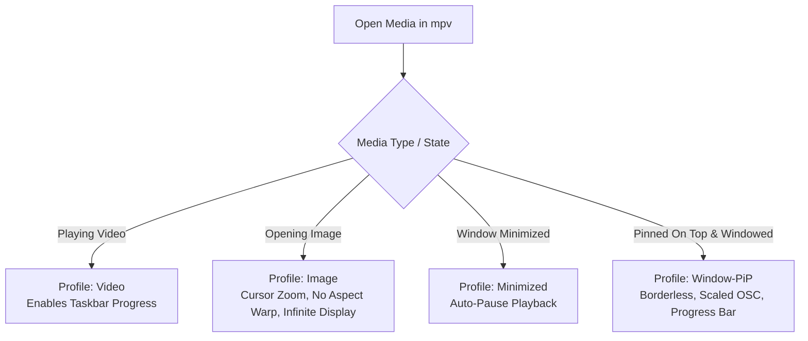

<div align="center">

# biraj-mpv-conf

**A refined, ultra-optimized, and modern configuration suite for [mpv media player](https://mpv.io/).**

[](https://mpv.io/)
[](https://mpv.io/manual/master/#options-vo)
[](https://mpv.io/manual/master/#options-hwdec)
[-orange?style=for-the-badge)](https://github.com/Samillion/ModernZ)
[](LICENSE)

<br/>

*Bridges the gap between mpv's lightweight performance and a sleek, feature-rich modern media player experience.*

[Key Features](#key-features) • [Installation](#installation) • [Keybindings](#keyboard--mouse-shortcuts) • [Smart Profiles](#smart-automation-profiles) • [Customization](#customization) • [Credits](#credits--acknowledgements)

---

</div>

## Overview

**`biraj-mpv-conf`** elevates mpv from a minimalist, command-line-driven player into a polished desktop media powerhouse. Designed with performance, aesthetics, and convenience in mind, it combines next-generation video rendering pipelines with a modern Fluent/Material user interface, interactive right-click context menus, fast hover thumbnails, native file pickers, and smart contextual profiles.

---

## Key Features

### Modern UI and Fluent On-Screen Controller
- **[ModernZ](https://github.com/Samillion/ModernZ) OSC Interface**: Replaces the default interface with a clean, responsive On-Screen Controller styled with Fluent/Material vector icons.
- **Translucent Minimalist OSD**: Dark pill-box OSD overlays with crisp typography, eliminating disruptive double seekbars.
- **Sleek Pause / Play Indicator**: Minimalist, non-distracting center pause/unpause visual flash indicators (`pause_indicator_lite`).

### Next-Gen GPU Video Rendering
- **`gpu-next` Engine**: Utilizes mpv's latest libplacebo-powered rendering backend for exceptional color accuracy and HDR processing.
- **Direct3D 11 Hardware Decoding (`d3d11va`)**: Blazing fast, low-CPU/low-power video decoding for 4K/8K media on modern GPUs.
- **Debanding and Temporal Dithering**: Eliminates color banding artifacts in dark scenes, anime, and compressed web video streams.
- **High-Fidelity Scaling**: Sigmoid upscaling and correct color-space downscaling algorithms for razor-sharp playback without ringing artifacts.

### Instant Seekbar Hover Thumbnails
- Integrated with **`thumbfast`** to provide instant, real-time visual preview thumbnails when hovering or scrubbing along the seekbar.

### Rich Right-Click Context Menu
- Full-featured **contextual GUI menu** (`menu.conf`) accessible on right-click:
  - Toggle audio/subtitle streams, secondary subtitles, and audio devices.
  - Switch ModernZ layouts (*Default, Compact, Mini, Seekbar*) and icon styles (*Fluent, Material*).
  - Adjust playback speed (*0.25x* to *8.0x*), A-B looping, aspect ratios, zoom, and rotation.
  - View real-time playback statistics, drop frames, and media information.

### Native Windows File and Track Selectors
- **PowerShell / WPF Native Dialogs**: Seamlessly browse and open files (`Ctrl+O`), load external subtitles (`Ctrl+S`), or attach secondary audio tracks (`Ctrl+A`) using standard Windows File Explorer dialogs.

### Smart Dynamic Profiles
- **Picture-in-Picture (`[Window-PiP]`)**: Automatically scales the OSC and enables a persistent progress bar when floating on-top in windowed mode.
- **Auto-Pause on Minimize (`[Minimized]`)**: Automatically pauses video when the player window is minimized to conserve resources.
- **Windows Taskbar Progress Indicator (`[Video]`)**: Displays live playback completion progress directly in the Windows taskbar icon.
- **Dedicated Image Viewer Mode (`[Image]`)**: Automatically converts mpv into an image viewer with cursor-centric mouse zoom (`Wheel Up/Down`), image recentering, and infinite display duration.

### Advanced Subtitle and Multi-Audio Management
- **Smart Directory Search**: Automatically scans `sub/`, `subs/`, `subtitles/`, `srt/`, and `ass/` subdirectories.
- **Subtitle Preroll**: Avoids missing subtitle lines when seeking into the middle of an MKV subtitle block.
- **Multi-Language Priority**: Default subtitle matching priority for English (`en`, `enm`) and audio stream selection for Hindi, English, and Japanese (`hi`, `en`, `ja`).

### High-Speed Streaming and Extended Format Support
- Integrated **`yt-dlp`** hook for seamless YouTube and web video streaming.
- Comprehensive support for modern image (`AVIF`, `JXL`, `WEBP`, `QOI`), audio (`FLAC`, `OPUS`, `ALAC`), and video containers (`MKV`, `MP4`, `WebM`, `M2TS`).

---

## Repository Structure

```plaintext
biraj-mpv-conf/
├── mpv.conf                  # Core configuration (renderer, cache, audio, video, profiles)
├── input.conf                # Custom keybindings, mouse shortcuts, and script triggers
├── menu.conf                 # Right-click context menu definitions
├── fonts/
│   └── modernz-icons.ttf     # Fluent & Material vector icons for ModernZ
├── scripts/
│   ├── modernz.lua           # Modern On-Screen Controller (OSC)
│   ├── open-file.lua         # Native Windows open file/subtitle/audio dialogs
│   ├── pause_indicator_lite.lua # Translucent center pause/resume indicator
│   └── thumbfast.lua         # High-performance seekbar thumbnail engine
├── script-opts/
│   ├── modernz.conf          # Configuration for ModernZ UI theme, layout, fonts
│   ├── pause_indicator_lite.conf # Configuration for pause visual effects
│   └── thumbfast.conf        # Configuration for thumbnail caching and size
├── biraj-mpv-guide.pdf       # Quick reference manual
└── LICENSE                   # Apache 2.0 Open Source License
```

---

## Installation

### Prerequisites
- **mpv**: Download the latest build from [mpv.io](https://mpv.io/installation/) or [shinchiro's builds](https://sourceforge.net/projects/mpv-player-windows/files/release/).
- **yt-dlp** *(Optional, for online streaming)*: Place `yt-dlp.exe` in your system `PATH` or in the mpv installation directory.

---

### Method 1: Standard Installation (Windows)

1. Clone or download this repository:
   ```bash
   git clone https://github.com/Biraj2004/biraj-mpv-conf.git
   ```
2. Press `Win + R`, type `%APPDATA%\mpv`, and press **Enter**.
3. Copy all files and folders from this repository into `%APPDATA%\mpv\`:
   ```plaintext
   C:\Users\<YourUsername>\AppData\Roaming\mpv\
   ├── fonts/
   ├── script-opts/
   ├── scripts/
   ├── input.conf
   ├── menu.conf
   └── mpv.conf
   ```
4. *(Recommended)* Install the icon font by double-clicking `fonts/modernz-icons.ttf` and clicking **Install**.

---

### Method 2: Portable Installation (All-in-One Folder)

If you are using a portable mpv build (e.g., extracted to `C:\mpv\` or a USB drive):
1. Navigate to your mpv root folder.
2. Create a folder named `portable_config`.
3. Copy all repository contents into:
   ```plaintext
   C:\mpv\portable_config\
   ├── fonts/
   ├── script-opts/
   ├── scripts/
   ├── input.conf
   ├── menu.conf
   └── mpv.conf
   ```

---

### Method 3: Linux / macOS

While tuned with Windows hardware acceleration (`d3d11va`) and PowerShell dialogs, you can use this configuration on Linux or macOS by adjusting a few options:
1. Copy the files to `~/.config/mpv/`.
2. In `mpv.conf`, update hardware decoding:
   - **Linux**: Change `hwdec=d3d11va` to `hwdec=vaapi` or `hwdec=nvdec`.
   - **macOS**: Change `hwdec=d3d11va` to `hwdec=videotoolbox` and `vo=gpu-next` to `vo=gpu-next` (MoltenVK).

---

## Keyboard & Mouse Shortcuts

### Mouse Controls
| Input | Action |
| :--- | :--- |
| **Double Click Left** | Toggle Fullscreen |
| **Right Click** | Open Context Menu (`menu.conf`) |
| **Mouse Hover Seekbar** | Show Fast Hover Thumbnail Preview (`thumbfast`) |
| **Scroll Wheel (Image Mode)** | Cursor-centric Zoom In / Zoom Out |

---

### Playback & Navigation
| Shortcut | Action |
| :--- | :--- |
| <kbd>Space</kbd> / <kbd>Media Play/Pause</kbd> | Toggle Play / Pause |
| <kbd>→</kbd> / <kbd>←</kbd> | Seek forward / backward 2 seconds (exact) |
| <kbd>Forward</kbd> / <kbd>Rewind</kbd> | Seek forward / backward 10 seconds |
| <kbd>Home</kbd> | Seek to beginning of media |
| <kbd>.</kbd> / <kbd>,</kbd> | Frame step forward / backward |
| <kbd>n</kbd> / <kbd>p</kbd> | Next / Previous playlist item |
| <kbd>l</kbd> | Set / Clear A-B repeat loop points |
| <kbd>q</kbd> / <kbd>Alt+F4</kbd> | Quit mpv (remembers watch history & playback position) |

---

### Audio & Subtitles
| Shortcut | Action |
| :--- | :--- |
| <kbd>b</kbd> | Cycle audio tracks *(VLC-style)* |
| <kbd>v</kbd> | Cycle subtitle tracks *(VLC-style)* |
| <kbd>↑</kbd> / <kbd>↓</kbd> | Volume up / down (+2% / -2%) |
| <kbd>m</kbd> / <kbd>Mute</kbd> | Toggle Mute |
| <kbd>Ctrl</kbd> + <kbd>s</kbd> | Open Native File Dialog to add Subtitle track |
| <kbd>Ctrl</kbd> + <kbd>a</kbd> | Open Native File Dialog to add Audio track |

---

### Window, UI & Dialogs
| Shortcut | Action |
| :--- | :--- |
| <kbd>f</kbd> | Toggle Fullscreen |
| <kbd>Esc</kbd> | Exit Fullscreen |
| <kbd>Tab</kbd> | Cycle ModernZ OSC visibility |
| <kbd>g</kbd> <kbd>m</kbd> | Open GUI menu |
| <kbd>Ctrl</kbd> + <kbd>o</kbd> | Open Native File Dialog to load Media file(s) |

---

### Image Viewer Mode
| Shortcut | Action |
| :--- | :--- |
| <kbd>Wheel Up</kbd> | Smooth Cursor-Centric Zoom In (+10%) |
| <kbd>Wheel Down</kbd> | Smooth Cursor-Centric Zoom Out (-10%) |
| <kbd>0</kbd> | Reset Image Position & Zoom to Center |

---

## Smart Automation Profiles

This configuration leverages mpv's conditional profiles for zero-friction playback automation:



1. **`[Window-PiP]`**:
   - **Trigger**: When `ontop=yes` and windowed (not fullscreen).
   - **Behavior**: Strips borders, scales OSC size by `1.8x` for readability at small sizes, and keeps progress bar active.
2. **`[Minimized]`**:
   - **Trigger**: When the mpv window is minimized (excluding audio album art).
   - **Behavior**: Pauses playback automatically and resumes upon restoration.
3. **`[Video]`**:
   - **Trigger**: Active video track with duration > 0.
   - **Behavior**: Activates Windows taskbar progress tracking.
4. **`[Image]`**:
   - **Trigger**: Still images (`png`, `jpg`, `webp`, `avif`, `jxl`, etc.).
   - **Behavior**: Holds display duration infinitely, centers view, and activates cursor-anchored zoom bindings.

---

## Customization

### 1. Changing Hardware Acceleration
In [`mpv.conf`](file:///c:/Users/biraj/Desktop/biraj-mpv-conf/mpv.conf#L46-L48):
```ini
# Default: Direct3D 11 (Best for Windows)
hwdec=d3d11va

# For NVIDIA GPUs with NVDEC:
# hwdec=nvdec

# For Linux (Intel / AMD):
# hwdec=vaapi

# For Apple Silicon:
# hwdec=videotoolbox
```

### 2. Audio & Subtitle Language Priorities
In [`mpv.conf`](file:///c:/Users/biraj/Desktop/biraj-mpv-conf/mpv.conf#L81-L84):
```ini
# Prioritize subtitle language (comma separated):
slang=en,enm,es,ja

# Prioritize audio language (comma separated):
alang=hi,en,ja
```

### 3. Screenshot Directory & Format
In [`mpv.conf`](file:///c:/Users/biraj/Desktop/biraj-mpv-conf/mpv.conf#L34-L39):
```ini
screenshot-format=png
screenshot-png-compression=6
screenshot-directory=~/Pictures/mpv-screenshots
screenshot-template=%F-(%P)-%n
```

### 4. ModernZ OSC Layout & Theme
You can change the OSC theme directly from the right-click context menu or by editing [`script-opts/modernz.conf`](file:///c:/Users/biraj/Desktop/biraj-mpv-conf/script-opts/modernz.conf#L1-L10):
```ini
layout=default        # Options: default, compact, mini, seekbar
icon_theme=fluent     # Options: fluent, material
icon_style=mixed      # Options: mixed, filled, outline
```

---

## Credits & Acknowledgements

This configuration is powered by the work of the mpv open-source community:

- **[mpv](https://mpv.io/)**: The ultra-customizable, open-source media player.
- **[ModernZ](https://github.com/Samillion/ModernZ)** by *Samillion*: Clean, modern OSC replacement with fluent iconography.
- **[thumbfast](https://github.com/po5/thumbfast)** by *po5*: High-performance on-the-fly thumbnail generator.
- **[pause_indicator_lite](https://github.com/mpv-player/mpv)**: Minimalist pause/resume visual indicator.
- **[mpv-open-file-dialog](https://github.com/rossy/mpv-open-file-dialog)** by *rossy*: Native Windows file dialog integration.

---

## License

This project is licensed under the **Apache License 2.0** - see the [LICENSE](LICENSE) file for details.
