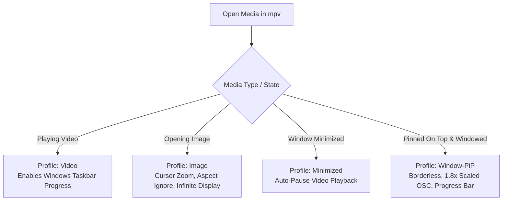

<div align="center">

# biraj-mpv-conf

**A refined, ultra-optimized, and modern configuration suite for [mpv media player](https://mpv.io/).**

[](https://mpv.io/)
[](https://mpv.io/manual/master/#options-vo)
[](https://mpv.io/manual/master/#options-hwdec)
[-orange?style=for-the-badge)](https://github.com/Samillion/ModernZ)
[](SECURITY.md)
[](LICENSE)

<br/>

*Bridges the gap between mpv's bare-metal performance and a sleek, feature-rich modern media player.*

[Live Documentation](https://biraj2004.github.io/biraj-mpv-conf/) • [Browser Extension Docs](https://biraj2004.github.io/biraj-mpv-conf/extension.html) • [Installation](#installation) • [Showcase](#visual-showcase) • [Usage Guide](#how-to-play--usage-guide) • [Companion Suites](#companion-suites--integrations) • [Features](#key-features) • [Shortcuts](#keyboard--mouse-shortcuts) • [Profiles](#smart-automation-profiles) • [HDR / Tone-Mapping](#hdr--dolby-vision-playback) • [Credits](#credits--acknowledgements)

---

</div>

## Overview

**`biraj-mpv-conf`** elevates mpv from a minimalist command-line player into a polished desktop media powerhouse. It pairs next-generation video rendering pipelines (`gpu-next` + `libplacebo`) with a modern Fluent/Material user interface, dynamic right-click menus, sub-100ms seekbar hover previews, native file pickers, real-time dialogue audio normalization, and smart contextual profiles.

---

## Visual Showcase

<div align="center">

### Modern Interface & Visual Scrubbing

| ModernZ OSC & Center Pause Indicator | Thumbfast Hover Preview & Subtitles |
| :---: | :---: |
| [](screenshots/modernz-osc-pause-indicator.jpg) | [](screenshots/thumbfast-hover-preview-subtitles.jpg) |
| *ModernZ Fluent controller, chapter title, stream download button, center pause badge & format badge.* | *Instant seekbar hover thumbnail preview (`thumbfast`) with high-contrast, black-outlined subtitle rendering.* |

### Real-Time Engine & Playback Performance

| 4K HDR10+ Playback Statistics (`gpu-next`) | 1080p SDR Video Playback Statistics |
| :---: | :---: |
| [](screenshots/stats-overlay-4k-hdr10plus.jpg) | [](screenshots/stats-overlay-1080p-sdr.jpg) |
| *`gpu-next` rendering pipeline, D3D11VA HW decode, 144 Hz display sync, and HDR10+ peak brightness metadata.* | *1080p AVC decoding, frame timings, 0 dropped frames, WASAPI audio output, and chapter indexing.* |

### Format Detection & Interactive Stream Diagnostics

| Dynamic HDR10+ Format Badge Overlay | Interactive Console & Stream Log Overlay |
| :---: | :---: |
| [](screenshots/hdr10plus-badge-overlay.jpg) | [](screenshots/interactive-console-stream-log.jpg) |
| *Top-right floating badge (`hdr_badge.lua`) automatically announcing detected HDR10+ format on start.* | *Interactive REPL console (`~`), automatic profile switching, ModernZ URL detection, and yt-dlp log stream.* |

### Smart Playlist Sorting & Native File Dialog

| Natural Ascending Playlist Sorter | Native File Picker Dialog (Unicode Support) |
| :---: | :---: |
| [](screenshots/playlist-menu-ascending-sort.jpg) | [](screenshots/native-file-picker-dialog.jpg) |
| *Interactive playlist menu arranged in natural numerical ascending order (EP1 &rarr; EP2 &rarr; EP10).* | *Windows native file picker dialog (<kbd>Ctrl</kbd>+<kbd>O</kbd>) supporting Unicode characters and special symbols.* |

</div>

---

## Installation

### Step 0: Install MPV & yt-dlp

You can choose between **zhongfly builds** (the build used to develop and test this suite) or the automated **winget** installation. Both builds work seamlessly.

#### Option 1: zhongfly mpv-winbuild (Used & Recommended)

We actively use and develop with the **zhongfly** build because it includes modern `gpu-next`, `libplacebo`, Vulkan/D3D11 rendering, and up-to-date video engine features.

1. Download the latest release from [**zhongfly mpv-winbuild Releases**](https://github.com/zhongfly/mpv-winbuild/releases) (for modern Intel/AMD CPUs, select the `x86_64-v3` build).
2. Extract the archive, rename the directory to `mpv`, and place it in **`C:\Program Files\mpv\`** so that the executable is located at `C:\Program Files\mpv\mpv.exe`.
3. Right-click **`mpv-register.bat`** &rarr; **Run as administrator** to register file associations and player protocols.
4. Install yt-dlp via winget:
   ```powershell
   winget install --id yt-dlp.yt-dlp
   ```

#### Option 2: Automated winget Install (Fastest)

Install MPV (shinchiro build) and yt-dlp directly via PowerShell:

```powershell
winget install --id shinchiro.mpv
winget install --id yt-dlp.yt-dlp
```

> [!IMPORTANT]
> **Check Installation Paths:**
> Both **zhongfly** and **shinchiro** builds work with this suite. However, for full integration (including the [Play in MPV Browser Extension](https://biraj2004.github.io/biraj-mpv-conf/extension.html), [Windows Context Menu](Windows-Context-Menu/), and auto-sync scripts), make sure `mpv.exe` is either placed at **`C:\Program Files\mpv\mpv.exe`** or its directory is added to your Windows system `PATH` environment variable.

---

### Step 1: Deploy Configuration Suite

Choose between the standard system-wide installation or standalone portable mode:

| Mode | Configuration Path | Best For |
| :--- | :--- | :--- |
| **Standard (Windows)** | `%APPDATA%\mpv\` (`C:\Users\<User>\AppData\Roaming\mpv\`) | Installed mpv builds & full context menu integration |
| **Portable** | `<MpvRoot>\portable_config\` | Self-contained folders, USB drives, or custom drives |
| **Linux / macOS** | `~/.config/mpv/` | Cross-platform systems |

#### Option A: Automated Sync Script (`.bat`) — *Fastest*
Clone or download this repo and run:
```cmd
Fetch_And_Update_Biraj_MPV_Config_From_Latest_GitHub_Commit.bat
```
- Automatically checks for `mpv.exe` at standard locations.
- Fetches the latest commit details from GitHub with a confirmation prompt.
- Creates an automatic timestamped backup in `%APPDATA%\mpv\backups\`.
- Deploys scripts, fonts, and configs cleanly into `%APPDATA%\mpv\`.

#### Option B: Manual Installation (ZIP)
1. Download [**Latest ZIP Archive**](https://github.com/Biraj2004/biraj-mpv-conf/archive/refs/heads/main.zip).
2. Copy the configuration folders (`fonts/`, `scripts/`, `script-opts/`) and configuration files (`mpv.conf`, `input.conf`, `menu.conf`, `yt-dlp.conf`) directly into your config folder (`%APPDATA%\mpv\` or `<mpv>\portable_config\`).
3. Install vector icons: Open `fonts/`, double-click **`modernz-icons.ttf`**, and click **Install**.

#### Option C: Linux / macOS
```bash
git clone https://github.com/Biraj2004/biraj-mpv-conf.git ~/.config/mpv
```
Automatic native fallbacks engage: Cocoa file dialogs via `osascript` on macOS, Zenity/KDialog on Linux, `coreaudio`/`pipewire` audio drivers, and POSIX domain sockets for `thumbfast`.

---

## How to Play & Usage Guide

### 1. Playing Local Media Files & Folders
- **Drag & Drop**: Drop any video, audio, image, or folder directly onto mpv.
- **Native File Picker (<kbd>Ctrl</kbd> + <kbd>O</kbd>)**: Opens Windows File Explorer (or macOS/Linux picker) with natural ascending file sorting.
- **File Explorer Context Menu**: Right-click any folder or selection and choose **"Play with MPV as a Playlist"** (configured via [`Windows-Context-Menu/`](Windows-Context-Menu/)).

### 2. Streaming Online URLs (YouTube, Twitch, Stremio & Web Video)
- **Drag & Drop URL**: Paste or drop any web stream or playlist URL into mpv.
- **Terminal Launch**:
  ```powershell
  # Stream best available up to 1440p 2K (default balanced profile)
  mpv "https://www.youtube.com/watch?v=dQw4w9WgXcQ"

  # Capped quality presets
  mpv --profile=q-1080p "https://www.youtube.com/watch?v=dQw4w9WgXcQ"
  mpv --profile=q-best  "https://www.youtube.com/watch?v=dQw4w9WgXcQ"
  ```
- **On-the-Fly Quality Switching**: Press <kbd>Ctrl</kbd> + <kbd>y</kbd> (or right-click &rarr; **Video** &rarr; **YT-Stream Quality**) to cycle resolutions (`720p` &rarr; `1080p` &rarr; `1440p` &rarr; `Best`). Resumes at the exact second.
- **One-Click Stream Download**: Click the download button on ModernZ OSC to download media to `~/Downloads/MPV-Downloads`.

### 3. Streaming Authentication & `yt-dlp.conf`
Advanced streaming and network options are isolated in [`yt-dlp.conf`](yt-dlp.conf):
- **Resilience**: 10 connection/fragment retries and 4 concurrent DASH chunks prevent HTTP 403 throttling.
- **Age-Restricted & Member Videos (Cookies)**:
  - **Static File (Recommended)**: Set `--cookies "E:\path\to\yt-cookies.txt"` in `yt-dlp.conf`.
  - **Browser Extraction**: Set `--cookies-from-browser firefox` (or `brave` / `chrome` / `edge`).

### 4. Audio, Subtitles & Playback Controls
- **Cycle Subtitles**: <kbd>v</kbd> / <kbd>Shift</kbd> + <kbd>v</kbd> (or <kbd>j</kbd> / <kbd>J</kbd>) with instant OSD, anti-spam debounce, and `Off/None` state.
- **Cycle Audio Tracks**: <kbd>b</kbd> / <kbd>Shift</kbd> + <kbd>b</kbd> (or <kbd>#</kbd> / <kbd>_</kbd>).
- **Add External Subtitle / Audio**: <kbd>Ctrl</kbd> + <kbd>s</kbd> (Subtitles) or <kbd>Ctrl</kbd> + <kbd>a</kbd> (Audio) to open the native picker.
- **Night Mode Dialogue Clarity**: <kbd>y</kbd> or <kbd>Shift</kbd> + <kbd>n</kbd> (<kbd>N</kbd>) balances explosions and quiet speech via `dynaudnorm` & vocal EQ.
- **Exact Seeking**: <kbd>→</kbd> / <kbd>←</kbd> (6s exact) • <kbd>Media Keys</kbd> (15s exact).
- **Performance HUD**: Press <kbd>i</kbd> for real-time stats (fps, dropped frames, libplacebo tone-mapping, HDR peak nits).

---

## Companion Suites & Integrations

First-party tools built to integrate MPV across your desktop workflow:

### 1. [Play in MPV Browser Extension](Browser-Play-in-MPV/)
- **Live Documentation**: [Browser Extension Guide](https://biraj2004.github.io/biraj-mpv-conf/extension.html)
- **Supported Browsers**: Google Chrome, Brave, Microsoft Edge, Opera, and Chromium-based browsers.
- **Seamless Streaming**: Injects a native MPV button into YouTube (watch player & Shorts) and Stremio Web (`web.stremio.com`), resuming at the exact timestamp while auto-pausing the web player.
- **Secure Architecture**: Sandboxed Chromium Native Messaging IPC with Python. Zero external network calls, zero telemetry, no open localhost ports, and 0 MB idle RAM.

### 2. [Stremio Desktop Integration](Stremio-Play-in-MPV/)
- **Documentation & Setup**: [`Stremio-Play-in-MPV/README.md`](Stremio-Play-in-MPV/README.md)
- **Windows & macOS**: One-click scripts ([`.bat`](Stremio-Play-in-MPV/Win_Setup_Stremio_To_Play_In_MPV.bat) / [`.sh`](Stremio-Play-in-MPV/macOS_Setup_Stremio_To_Play_In_MPV.sh)) patch Stremio desktop to add **"Play in MPV"** directly alongside VLC.

### 3. [Windows File Explorer Context Menu](Windows-Context-Menu/)
- **Documentation & Setup**: [`Windows-Context-Menu/README.md`](Windows-Context-Menu/README.md)
- **Play as Playlist**: Adds a right-click **"Play with MPV as a Playlist"** option to folders, multi-selected files, and external drives using HKCU registry entries (no admin rights needed).

---

## Key Features

### Modern UI & On-Screen Controller
- **[ModernZ OSC](https://github.com/Samillion/ModernZ) ([`scripts/modernz.lua`](scripts/modernz.lua))**: Responsive Fluent & Material controller with layout presets (*default, compact, mini, seekbar*).
- **Translucent Pillbox OSD**: Crisp Segoe UI typography with 2.5s readable durations (`osd-duration=2500`), eliminating disruptive double seekbars (`osd-bar=no`).
- **Visual Pause & Unpause Indicator ([`pause_indicator_lite.lua`](scripts/pause_indicator_lite.lua))**: Subtle, non-distracting center canvas feedback.

### Next-Gen GPU Rendering & Tone-Mapping
- **`gpu-next` Engine ([`mpv.conf`](mpv.conf))**: libplacebo-powered rendering backend for high-bitdepth pipelines, debanding, and color accuracy.
- **D3D11 Flip Presentation (`d3d11-flip=yes`)**: Tear-free, zero-frame-drop presentation on Windows with instant 0ms Alt-Tab.
- **HDR10 & Dolby Vision Tone-Mapping**: Dynamic tone-mapping of HDR10 and Dolby Vision (Profiles 5 & 8) into standard sRGB/BT.709 displays without washed-out highlights (`target-contrast=auto`).
- **Dynamic Format Badge ([`scripts/hdr_badge.lua`](scripts/hdr_badge.lua))**: Non-intrusive floating badge announcing detected video stream format (`DV`, `HDR10+`, `HDR10`, `HLG`, `SDR`).
- **Windows WASAPI Shared Audio (`ao=wasapi`)**: 90ms low-latency hardware buffer (`audio-buffer=0.09`) with zero audio cutoffs on unpause (`audio-stream-silence=yes`).
- **Segregated Cache Architecture ([`scripts/cache_manager.lua`](scripts/cache_manager.lua))**: Isolates shaders, watch history, thumbnails, and demuxer data into `%LOCALAPPDATA%\mpv\cache\`, automatically cleaning old scratch files.

### Scrubbing, Playlists & Navigation
- **High-Speed Seekbar Thumbnails ([`scripts/thumbfast.lua`](scripts/thumbfast.lua))**: On-demand generator using unbuffered Win32 Named Pipes (`direct_io=yes`) for sub-100ms hover latency.
- **Natural Ascending Playlist Sorter ([`scripts/sort_playlist.lua`](scripts/sort_playlist.lua))**: Automatically filters non-video clutter and orders multi-file batches alphanumerically (`EP1` &rarr; `EP2` &rarr; `EP10`). Press <kbd>Shift</kbd> + <kbd>k</kbd> (<kbd>K</kbd>) to sort on demand.
- **Native File Dialogs ([`scripts/open-file.lua`](scripts/open-file.lua))**: Opens Windows PowerShell WPF pickers (Cocoa on macOS, Zenity/KDialog on Linux) with full UTF-8 Unicode support.
- **Comprehensive Context Menu ([`menu.conf`](menu.conf))**: Right-click access to audio/sub tracks, Night Mode normalization, speed controls, and video filters.

### Automated Notifications & Boundaries
- **Collision-Free Pause Notification ([`scripts/pause_notify.lua`](scripts/pause_notify.lua))**: Displays a top-left badge (`Paused at hr:min:sec / total time`) that dynamically shifts down when other OSD messages appear, automatically suppressing during stats (<kbd>i</kbd>) and console (<kbd>`</kbd>).
- **Graceful EOF Auto-Exit ([`scripts/auto_exit_eof.lua`](scripts/auto_exit_eof.lua))**: Pauses on the last frame for 4s with a 2s countdown before exit; aborts instantly on user input.
- **Resume Notification ([`scripts/resume_indicator.lua`](scripts/resume_indicator.lua))**: Shows `Resuming: (MM:SS / Total)` when continuing unfinished videos, suppressing accidental short clips &le; 100s.
- **Anti-Spam Audio Cycler ([`scripts/cycle_audio.lua`](scripts/cycle_audio.lua))**: Debounced 30ms track cycler preventing audio pops, video freezes, and race conditions during rapid key presses.

---

## Repository Architecture

```plaintext
biraj-mpv-conf/
├── mpv.conf                  # Core configuration (renderer, cache, audio, profiles)
├── input.conf                # Custom keybindings and script bindings
├── menu.conf                 # Right-click context menu structure
├── yt-dlp.conf               # Streaming network retries and format selectors
├── Fetch_And_Update_Biraj_MPV_Config_From_Latest_GitHub_Commit.bat # Interactive updater
├── Browser-Play-in-MPV/      # Chromium browser companion extension (Manifest V3 + Native Host)
├── Stremio-Play-in-MPV/      # Stremio desktop player integration scripts
├── Windows-Context-Menu/     # Windows File Explorer context menu registry installers
├── fonts/                    # Fluent vector icons (modernz-icons.ttf)
├── scripts/                  # Performance, sorting, and interface Lua scripts
├── script-opts/              # Script configuration profiles
├── docs/                     # Interactive web portal (GitHub Pages)
├── biraj-mpv-key-binding.pdf # 1-page visual shortcuts cheatsheet (XeLaTeX)
├── biraj-mpv-guide.pdf       # Comprehensive reference guide (XeLaTeX)
├── SECURITY.md               # Security policy and vulnerability disclosure
└── LICENSE                   # Apache 2.0 Open Source License
```

---

## Keyboard & Mouse Shortcuts

> [!TIP]
> Download the printable **[1-Page Keyboard & Mouse Shortcuts PDF](biraj-mpv-key-binding.pdf)** or view the complete manual in **[biraj-mpv-guide.pdf](biraj-mpv-guide.pdf)**.

<div align="center">

[](docs/assets/keybindings-chart.jpg)

</div>

### Essential Shortcuts

| Category | Shortcut | Action |
| :--- | :--- | :--- |
| **Playback** | <kbd>Space</kbd> | Toggle Play / Pause |
| | <kbd>→</kbd> / <kbd>←</kbd> | Exact seek forward / backward **6 seconds** |
| | <kbd>Media Next</kbd> / <kbd>Prev</kbd> (or <kbd>n</kbd> / <kbd>p</kbd>) | Next / Previous playlist episode |
| | <kbd>k</kbd> / <kbd>Shift</kbd> + <kbd>k</kbd> (<kbd>K</kbd>) | Open playlist menu / Sort playlist naturally |
| **Audio** | <kbd>b</kbd> / <kbd>Shift</kbd> + <kbd>b</kbd> (<kbd>B</kbd>) | Cycle audio tracks forward / backward *(VLC & MPV standard)* |
| | <kbd>y</kbd> / <kbd>Shift</kbd> + <kbd>n</kbd> (<kbd>N</kbd>) | **Toggle Night Mode Dialogue Clarity & Normalization** |
| | <kbd>↑</kbd> / <kbd>↓</kbd> (or Scroll Wheel) | Volume up / down (±5%) |
| | <kbd>Ctrl</kbd> + <kbd>a</kbd> | Open Native File Dialog to add Audio track |
| **Subtitles** | <kbd>v</kbd> / <kbd>Shift</kbd> + <kbd>v</kbd> (<kbd>V</kbd>) | Cycle subtitle tracks forward / backward *(includes Off/None)* |
| | <kbd>z</kbd> / <kbd>Shift</kbd> + <kbd>z</kbd> (<kbd>Z</kbd>) | Adjust Subtitle delay (&minus;100ms / +100ms) |
| | <kbd>r</kbd> / <kbd>t</kbd> | Shift subtitle vertical position up / down |
| | <kbd>Ctrl</kbd> + <kbd>s</kbd> | Open Native File Dialog to add Subtitle track |
| **Video & UI** | <kbd>f</kbd> / Double Click | Toggle Fullscreen |
| | <kbd>Right Click</kbd> / <kbd>g</kbd> <kbd>m</kbd> | Open Context Menu |
| | <kbd>l</kbd> | Toggle Dynamic Format Badge (DV / HDR10+ / HDR / SDR) |
| | <kbd>Ctrl</kbd> + <kbd>y</kbd> | Cycle Streaming Quality (*720p &rarr; 1080p &rarr; 1440p &rarr; Best*) |
| | <kbd>g</kbd> | Toggle Debanding filter |
| | <kbd>i</kbd> | Toggle Real-Time Performance & Dropped Frame Statistics |
| | <kbd>s</kbd> / <kbd>Shift</kbd> + <kbd>s</kbd> (<kbd>S</kbd>) | Take Screenshot / Screenshot without subtitles |
| | <kbd>Ctrl</kbd> + <kbd>o</kbd> | Open Native File Dialog to load Media file(s) |

---

## HDR & Dolby Vision Playback

1. **SDR Displays**: HDR10 and Dolby Vision (Profiles 5 & 8.1) video streams are dynamically tone-mapped into the standard sRGB/BT.709 gamut with automatic peak brightness calculation (`hdr-compute-peak=auto`), preventing washed-out colors.
2. **Native HDR Displays**: `target-colorspace-hint=auto` signals Windows Display Subsystem to pass wide-gamut BT.2020 metadata directly to your HDR monitor or TV.

### Reference Benchmark Hardware
All configurations, tone-mapping curves, and real-time playback benchmarks were profiled on this reference system:

| Component | Hardware Specification |
| :--- | :--- |
| **CPU** | Intel Core i5-10300H @ 2.50GHz (4 Cores / 8 Threads, 4.50GHz Turbo) |
| **GPU** | NVIDIA GeForce GTX 1650 Ti (4GB GDDR6 VRAM) |
| **RAM & OS** | 16 GB DDR4 &bull; Windows 10 Home 64-bit |
| **Storage & MPV** | PCIe NVMe SSD &bull; [zhongfly git builds](https://github.com/zhongfly/mpv-winbuild/releases) (`gpu-next`, `libplacebo`, Vulkan/D3D11) |

> [!NOTE]
> The format badge overlay reflects the **color metadata of the incoming video file**, confirming active tone-mapping on SDR displays.

---

## Smart Automation Profiles

Conditional profiles automatically adapt playback based on media state:



---

## Customization & Tweaks

Key settings easily modified in [`mpv.conf`](mpv.conf):

```ini
# Hardware Decoding: auto-safe (default), d3d11va, nvdec, vaapi, or videotoolbox
hwdec=auto-safe

# Preferred Audio and Subtitle Languages (comma separated priority)
alang=hi,en,ja
slang=en,enm

# Subtitle Styling
sub-font-size=50
sub-color="#FFFFFF"
sub-border-size=1.8
sub-border-color="#000000"

# Screenshots Directory
screenshot-directory=~/Pictures/MPV-Screenshots
screenshot-format=jpeg
screenshot-jpeg-quality=99
```

---

## Credits & Acknowledgements

### Author & Maintainer
- **[Biraj Sarkar](https://github.com/Biraj2004)** ([@Biraj2004](https://github.com/Biraj2004)):
  - Creator and maintainer of **`biraj-mpv-conf`**.
  - **`cycle_audio.lua`**: Anti-spam debounced audio & subtitle track cycler with two-pass deterministic matching and instant OSD.
  - **`sort_playlist.lua`**: Natural alphanumeric ascending playlist sorting engine with non-video clutter filtering.
  - **`hdr_badge.lua`**, **`resume_indicator.lua`**, & **`pause_notify.lua`**: Dynamic format badge overlay, on-screen resume notifications, and collision-free OSD pause alerts with native bare-metal opening speed.
  - **`auto_exit_eof.lua`**: Graceful 4s end-of-media auto-exit with 2s OSD countdown and instant seek abort.
  - **`single_instance.lua`**: Win32 FFI zero-CPU sleep implementation for multi-file enqueueing.
  - **Integrations & Documentation**: [Play in MPV Extension](https://biraj2004.github.io/biraj-mpv-conf/extension.html), [Stremio Desktop Hooks](Stremio-Play-in-MPV/), [Windows Context Menu](Windows-Context-Menu/), and interactive documentation portal.

### Upstream Open-Source Projects
- **[mpv](https://mpv.io/)** ([mpv-player/mpv](https://github.com/mpv-player/mpv)): The core open-source media player.
- **[mpv-winbuild](https://github.com/zhongfly/mpv-winbuild/releases)** by [zhongfly](https://github.com/zhongfly): Windows builds with `gpu-next`, `libplacebo`, and Vulkan/D3D11.
- **[ModernZ](https://github.com/Samillion/ModernZ)** by [Samillion](https://github.com/Samillion): Modern Fluent & Material On-Screen Controller.
- **[thumbfast](https://github.com/po5/thumbfast)** by [po5](https://github.com/po5): High-performance seekbar thumbnail generator.
- **[play-in-mpv](https://github.com/baldomo/play-in-mpv)** by [Francisco Becheli](https://github.com/baldomo): Original concept and inspiration for browser-to-mpv Native Messaging integration.
- **[pause_indicator_lite](https://github.com/Samillion/ModernZ/tree/main/extras/pause-indicator-lite)** & **[open-file](https://github.com/Samillion/ModernZ/tree/main/extras/open-file)** by [Samillion](https://github.com/Samillion) (fork of [rossy](https://github.com/rossy)): Pause feedback & native Windows file dialog integration.
- **[yt-dlp](https://github.com/yt-dlp/yt-dlp)**: Audio/video streaming extraction engine.
- **[FFmpeg](https://ffmpeg.org/)** & **[libplacebo](https://code.videolan.org/videolan/libplacebo)**: Video decoding, debanding, and color tone-mapping engines.

---

## Security

Please refer to the [SECURITY.md](SECURITY.md) policy for supported versions and vulnerability disclosure.

---

## License

This project is licensed under the **Apache License 2.0** — see the [LICENSE](LICENSE) file for details.
